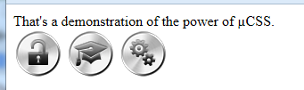
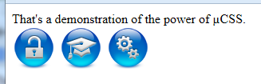
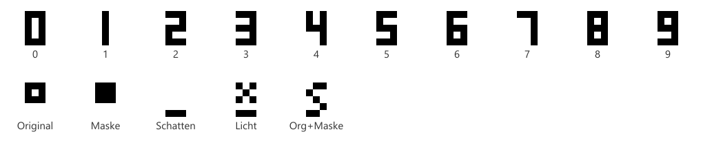

# Einführung

<p align="center">
  
</p>

µCSS ist ein Node-Modul zur Verarbeitung von CSS-Dateien und zur Generierung von Web-Grafiken. Dieses Handbuch beschreibt die Version 2 — den Node-basierten Nachfolger des 2013 eingeführten, Adobe-Photoshop-basierten µCSS 1: Aus erweiterten Quell-Stylesheets (`.µ.css`) und den Medienquellen (z. B. PSD-Entwürfen) entstehen per Gulp die fertigen Skin-Dateien — Standard-CSS plus alle benötigten Bilder, Sprites, Cursor, Fonts und Sounds. Die Bilderzeugung übernimmt das Schwester-Modul µPS; Sound-Atlanten und Icon-Fonts die Module µAU und µFT — jeweils als eigenes Kapitel (*microPS*, *microAU*, *microFT*).

Da das µ-Zeichen in Paket- und Repository-Namen (npm, git) immer wieder Probleme bereitet, lauten die technischen Namen `gulp-mu-css` und `gulp-mu-ps` — µCSS und µPS sind die Anzeigenamen.

Die wichtigsten Eigenschaften von µCSS 2:

- Quell-Stylesheets bleiben **syntaktisch valides CSS** — Editoren, Linter und Diff-Werkzeuge funktionieren unverändert.
- **Benannte CSS-Eigenschaften** über Skin-Variablen (`$.name`).
- **Berechnung von CSS-Werten durch JavaScript-Ausdrücke** direkt im Stylesheet — ohne Ersatzzeichen wie `«»¡`.
- **Mehrere Layouts (Skins)** aus denselben Quellen über Manifest-Dateien.
- **Automatische Sprite-Atlas-Generierung** inklusive Retina-Varianten (`@2x`) und `image-set()`.
- **Cursor-Verwaltung** mit Hotspot, Fallback und Retina-Unterstützung.
- **Vorladen von CSS-Bildern** über eine generierte Preload-Regel.
- **Automatische Bilderzeugung** aus PSD-Entwürfen (Buttons, Icons, App-Icons, Animations-Strips) via µPS.
- **Inkrementeller Build mit Cache** — nur Geändertes wird neu generiert.
- **Aussagekräftige Fehlermeldungen** mit Datei, Zeile und Quelltext-Ausschnitt.

Im Gegensatz zu µCSS 1 läuft Version 2 vollständig in Node.js (ab Version 18) und benötigt weder Photoshop noch andere Adobe-Produkte. Die Build-Steuerung erfolgt über Gulp oder direkt über die Node-API.

## Werkzeuge und Kosten

Version 2 braucht **kein Adobe-Abo** für den Build: Sprites, Cursor und PSD-Rendering laufen headless über Node und µPS.

Geschichtete PSD-Entwürfe pflegt man mit **beliebigem Editor** — der Build ist identisch. **Affinity** und **Photopea** sind gängige kostenlose Optionen; **Adobe Photoshop** funktioniert ebenfalls (`.psd`-Verknüpfung oder Pfad zur `.exe`). Als PSD speichern; µPS liest dieselbe Ebenenstruktur. Bei µCSS 1 hingen Kompilierung und Bitmap-Erzeugung an einer lizenzierten Desktop-Bildbearbeitung — laufende Kosten, die für viele Teams entfallen.

## Draft-Workflow (Authoring + Watch)

Kein Editor ist für den Build vorgeschrieben. Zum **Öffnen** aus µPS: **`MU_DRAFT_APP`** (oder `OpenDrafts(…, { app })`):

| `app` / Env | Editor |
| :--- | :--- |
| `default` (Standard) | OS-Standard für `.psd` (oft Photoshop, wenn installiert) |
| `affinity` | Affinity Photo (optional `MU_AFFINITY_EXE`) |
| `<Pfad zu .exe/.app>` | Explizite App, z. B. Photoshop |
| `photopea` | Browser — **`await OpenPhotopeaDrafts(…)`** (async), nicht `OpenDrafts` |

Die Automatisierung teilt sich für alle Editoren gleich:

| Schritt | Werkzeug | Rolle |
| :--- | :--- | :--- |
| Authoring | Ihr Editor (Affinity, Photoshop, Photopea, …) | Geschichtete PSD-Entwürfe pflegen |
| Trigger | PSD speichern → `WatchDrafts` (µPS) oder `gulp.watch` | Entprellter Rebuild (~1,5 s) |
| Verarbeitung | µPS in Node | Ebenen lesen, Stile übertragen, compositen, PNG-Export |
| Optional | `OpenDrafts` / `OpenPhotopeaDrafts` | Entwurf im gewählten Editor öffnen |

µPS übernimmt die Ebenenlogik des alten Photoshop-Skripts; der Editor liefert nur die Quelldatei. API in `gulp-mu-ps`: `OpenDrafts`, `OpenPhotopeaDrafts`, `WatchDrafts`; CLI: `tools/open-drafts.mjs`, `tools/watch-drafts.mjs`. Details: `docs/CONCEPT.md` (D11/D11b).

### Photopea (Browser, optional)

Wer keine Desktop-App installieren möchte, kann [Photopea](https://www.photopea.com/) nutzen (kostenlos, volle PSD, lokal). **`OpenPhotopeaDrafts`** nur bei Browser-Wunsch — sonst reicht `OpenDrafts` mit Affinity oder Photoshop.

```js
import { OpenPhotopeaDrafts, WatchDrafts } from "gulp-mu-ps";

WatchDrafts(["dev/media/final/general/gui/buttons.psd"], () => buildSkin());

await OpenPhotopeaDrafts(["dev/media/final/general/gui/buttons.psd"], {
	saveBack: true,
	onSave: ({ path }) => console.log("Aktualisiert:", path)
});
```

CLI: `node gulp-mu-ps/tools/open-drafts.mjs --app photopea pfad/zum/entwurf.psd` (läuft bis Ctrl+C für Save-back). Env: `MU_PHOTOPEA_SCRIPT` (optionales Skript nach dem Laden).

## Einordnung: Warum µCSS?

Für fast jeden Teilaspekt von µCSS existiert ein etabliertes Einzelwerkzeug — aber kein System, das alles bündelt:

| Funktion | Nächstes existierendes Pendant | Was dort fehlt |
| :--- | :--- | :--- |
| Variablen & Farbfunktionen | Sass/LESS (`lighten()`, `mix()`), natives CSS (`color-mix()`, Custom Properties) | kein eingebettetes JavaScript |
| JavaScript in CSS-Werten | postcss-functions (registrierte JS-Funktionen als CSS-Funktionen) | nur benannte Funktionen — keine freien Ausdrücke, keine Direktiven mit Regel-/Dokument-Zugriff |
| Stylesheets mit voller JS-Power | vanilla-extract (Stylesheets-in-TypeScript) | umgekehrter Ansatz — das normale CSS-Format geht verloren |
| Sprite-Atlas aus CSS-Referenzen | spritesmith-Familie, postcss-sprites | weitgehend eingefroren, kein Retina-`image-set`-Workflow, kein gemeinsamer Cache |
| Bilderzeugung aus PSD-Entwürfen | nur Bausteine (`ag-psd`, Asset-Export aus Figma/Sketch) | kein Serien-Rendering mit Ebenenstil-Übertragung, nicht mit dem CSS-Build gekoppelt |
| Cursor, Preload, Skin-Manifest, Medien-Cache | handgestrickte Build-Skripte | nirgends gebündelt |

Ein Teil der ursprünglichen µCSS-Motivation von 2013 ist heute durch natives CSS gelöst (Custom Properties, `color-mix()`, Nesting) — deshalb verzichtet µCSS 2 bewusst auf LESS-Unterstützung und Vendor-Prefixes. Der verbleibende Kern ist konkurrenzlos: beliebige JavaScript-Ausdrücke im CSS plus Direktiven mit AST-Zugriff, gekoppelt mit Sprite-Atlas inklusive Retina, PSD-Render-Pipeline und inkrementellem Cache, gesteuert über ein Manifest pro Skin. Und da µCSS intern eine PostCSS-Pipeline ist, bleibt das gesamte PostCSS-Ökosystem (cssnano, Stylelint, …) andockbar, statt in Konkurrenz dazu zu stehen.

# Installation und Start

µCSS und µPS sind als npm-Module `gulp-mu-css` und `gulp-mu-ps` verfügbar. Die Installation erfolgt im eigenen Projekt:

```
npm install gulp-mu-css gulp-mu-ps
```

µCSS hängt von µPS ab (Atlas- und Bilderzeugung) — nicht umgekehrt. Beide Module sind separat verwendbar.

Der typische Einstieg ist ein Gulp-Task, der ein Skin-Manifest baut:

```js
// gulpfile.mjs
import gulp from "gulp";
import { BuildSkin } from "gulp-mu-css";

export async function SkinStd() {
	await BuildSkin("skins/src/std.µcss.mjs");
}
export function SkinWatch() {
	gulp.watch(["skins/src/**", "dev/media/final/**"], SkinStd);
}
```

Der Aufruf `npx gulp SkinStd` kompiliert den Skin „std" in das Verzeichnis `skins/std/`. `BuildSkin` ist idempotent und cache-gestützt: Ein zweiter Aufruf ohne Änderungen ist nach wenigen Millisekunden fertig (siehe Kapitel „Build-Ablauf").

# Anwendungsfälle

Die folgenden Abschnitte zeigen die typischen Einsatzszenarien — analog zu den Use Cases des alten µCSS-Handbuchs, aber in der neuen Syntax.

## Benannte Eigenschaften (Variablen)

Der einfachste Anwendungsfall: Ein Wert wird einmal im Skin-Manifest benannt und an beliebig vielen Stellen verwendet. Im Manifest:

```js
// skins/src/std.µcss.mjs
import { DefineSkin } from "gulp-mu-css";

export default DefineSkin({
	vars: {
		textColor: "#ff0000",
		backColor: "#0000ff"
	},
	files: [{ source: "src.µ.css", target: "std.css" }]
});
```

Im Quell-Stylesheet `src.µ.css`:

```css
div.mydiv {
	padding: 5px;
	font-size: 24px;
	color: µ($.textColor);
	background-color: µ($.backColor);
	border: 10px µ($.backColor) solid;
	border-radius: 10px;
}
```

Kompiliert nach `std.css`:

```css
div.mydiv {
	padding: 5px;
	font-size: 24px;
	color: #ff0000;
	background-color: #0000ff;
	border: 10px #0000ff solid;
	border-radius: 10px;
}
```

Anders als beim alten µCSS sind keine Platzhalter-Properties und keine `Set*`-Direktiven mehr nötig: Der Wert steht direkt dort, wo er hingehört.

## Berechnungen und Ausdrücke

Der Inhalt von `µ(...)` ist ein beliebiger JavaScript-Ausdruck. Damit sind Berechnungen, Bedingungen und Farboperationen direkt im Stylesheet möglich:

```css
td.subheadline {
	border-bottom: 1px dashed µ(Lighten($.selectBaseBrgdColor, 0.7));
}
div.panel {
	padding: µ(Math.floor($.basePadding * 0.2))px;
	background-color: µ(Alpha($.baseBrgdColor, 0.85));
	z-index: µ($.PanelZIndex + 10);
}
div.hint {
	color: µ($.darkMode ? "#e0e0e0" : "#202020");
}
```

Für Operationen, die mehrere Properties erzeugen oder die Regel als Ganzes verändern, gibt es Direktiven (`-µ:`), zum Beispiel mit eigenen Makro-Funktionen aus dem Manifest:

```css
div.menu {
	-µ: Borders($.menuBaseBrgdColor, 1, 0.3, -0.3, -0.3, 0.3);
}
```

Die Direktive ruft die Helper-Funktion `Borders` auf, die vier `border-*`-Properties berechnet und in die Regel einfügt (siehe Kapitel „µ-Auswertungskontext").

## Mehrere Layouts über Skin-Manifeste

Das alte Template-Compiling (eine Vorlagen-CSS plus je eine `µ.layout.css` pro Layout) wird durch mehrere Manifeste ersetzt, die sich dieselben `.µ.css`-Quellen teilen:

```js
// skins/src/layout_a.mjs
import { DefineSkin } from "gulp-mu-css";
export default DefineSkin({
	vars: { textColor: "#ff0000", backColor: "#0000ff" },
	files: [{ source: "template.µ.css", target: "layout_a.css" }]
});
```

```js
// skins/src/layout_b.mjs
import { DefineSkin } from "gulp-mu-css";
export default DefineSkin({
	vars: { textColor: "#ff00ff", backColor: "#00ff00" },
	files: [{ source: "template.µ.css", target: "layout_b.css" }]
});
```

Jedes Manifest erzeugt ein eigenes Ausgabeverzeichnis (`skins/layout_a/`, `skins/layout_b/`) mit eigener CSS, eigenen Bildern und eigenem Build-Cache. Gemeinsame Variablen lassen sich als normales JavaScript-Modul importieren und in beiden Manifesten verwenden.

## Automatische Sprite-Generierung

Eines der Highlights von µCSS (in Version 1 wie in Version 2) ist die automatische Erzeugung von Sprite-Atlanten. Die Direktive `Sprite(url)` registriert das Bild einer Regel für den Atlas:

```css
div.loginbutton {
	display: inline-block;
	-µ: Sprite("imgs/aqua/but_login_normal.png");
}
div.loginbutton:hover {
	display: inline-block;
	-µ: Sprite("imgs/aqua/but_login_hover.png");
}
div.helpbutton {
	display: inline-block;
	-µ: Sprite("imgs/aqua/but_help_normal.png");
}
```

Beim Build werden alle registrierten Bilder in ein einziges Atlas-Bild gepackt (`imgs/sprites.png`, dazu `imgs/sprites@2x.png` aus den `@2x`-Quellbildern) und die Regeln umgeschrieben:

```css
div.loginbutton {
	display: inline-block;
	background-image: url(imgs/sprites.png);
	background-image: image-set(url(imgs/sprites.png)1x, url(imgs/sprites@2x.png)2x);
	background-repeat: no-repeat;
	background-position: 0px 0px;
	width: 55px;
	height: 55px;
}
```

`width`, `height`, `background-position` und `background-repeat` werden automatisch gesetzt; vorhandene Deklarationen dieser Properties in der Regel werden ersetzt. Anders als beim alten µCSS entfallen die Vendor-Prefix-Varianten (`-webkit-image-set` usw.) — alle relevanten Browser unterstützen `image-set()` seit Jahren unprefixt.

Identische Quellbilder teilen sich automatisch eine Atlas-Position (Duplikat-Reduktion). Der Atlas wird nur neu gepackt, wenn sich die Bildmenge oder ein Quellbild geändert hat.

## Bilder vorladen (Preload)

Wichtige Bilder (z. B. Hover-Zustände und Cursor) können beim Laden der Seite vorab geladen werden. µCSS sammelt die Bild-URLs und erzeugt eine Preload-Regel, wenn die Manifest-Option `sprites.preloadRule` gesetzt ist:

```css
div.csspreload {
	background-image: url(imgs/sprites.png), url(imgs/general/gui/cursors/zoom.png);
	display: none;
}
```

In der HTML-Seite genügt ein leeres Element mit dieser Klasse:

```html
<div class="csspreload"></div>
```

Cursor-Bilder aus den `cursors`-Definitionen werden automatisch in die Preload-Liste aufgenommen.

## Cursor mit Hotspot und Fallback

Cursor werden im Manifest definiert und im Stylesheet per Name verwendet. Definition:

```js
cursors: [
	{ name: "zoom", fallback: "zoom-in", image: "imgs/general/gui/cursors/zoom.png", hotspot: [10, 8] },
	{ name: "wait", fallback: "wait", image: "imgs/general/gui/cursors/wait.png", hotspot: [12, 12] }
]
```

Verwendung als Direktive oder als Wertform:

```css
*.cursor_zoom {
	-µ: Cursor("zoom");
}
a.preview {
	cursor: µ(Cursor("zoom"));
}
```

Die Direktive erzeugt die `url()`-Form mit Hotspot und Fallback sowie — wenn eine `@2x`-Bilddatei existiert — zusätzlich die `image-set()`-Variante:

```css
*.cursor_zoom {
	cursor: url(imgs/general/gui/cursors/zoom.png) 10 8, zoom-in;
	cursor: image-set(url(imgs/general/gui/cursors/zoom.png)1x, url(imgs/general/gui/cursors/zoom@2x.png)2x) 10 8, zoom-in;
}
```

## Automatische Bilderzeugung (media-Steps)

Was früher die µCSS-Plugins (ButtonCreator, AppIconMaker, FileCopy) erledigt haben, übernehmen jetzt die `media`-Einträge im Manifest. Sie laufen vor der CSS-Kompilierung und erzeugen bzw. kopieren alle Medien in das Skin-Verzeichnis:

```js
media: [
	{ buttonsAndIcons: "dev/media/final/general/gui/panelbuttons.psd", layout: "std", outputDir: "imgs/general/gui/panelbuttons" },
	{ buttonsAndIcons: "dev/media/final/general/gui/cursors.psd", layout: "std", outputDir: "imgs/general/gui/cursors" },
	{ appIcons: "dev/media/final/favicon.psd", layout: "std", profiles: ["web"] },
	{ sequenceStrip: "dev/media/raw/glittery/imgs", outputFile: "imgs/general/gui/glittery/glittery.png" },
	{ copy: "dev/media/final/general/gui/teaserbgrd.png", to: "imgs/general/gui" },
	{ copyFolder: "dev/media/final/fonts", to: "fonts" }
]
```

### Eigene media-Steps (Plugins)

Eingebaute Steps ersetzen die Legacy-µCSS-Plugins. Für projektspezifische Generatoren (analog ButtonAndIconCreator) Handler **vor** `BuildSkin` registrieren:

```js
import { RegisterMediaStep, BuildSkin } from "gulp-mu-css";

RegisterMediaStep("myTiles", async (step, ctx) => {
	return { type: "myTiles", skipped: false, outputs: [/* absolute Pfade */] };
});

await BuildSkin("mySkin.µcss.mjs");
// Manifest: { myTiles: { source: "…", outputDir: "…" } }
```

Siehe `docs/CONCEPT.md` (D13). Built-in-Schlüssel (`buttonsAndIcons`, `copy`, …) sind nicht überschreibbar.

- **`buttonsAndIcons`** rendert aus einem geschichteten PSD-Entwurf (Layouts × Icon-Glyphen) komplette Button- und Icon-Serien inklusive `@2x`-Varianten — der Nachfolger des ButtonCreator-Plugins. Die Fülloptionen (Schlagschatten, Verläufe, Schein, Relief, **Kontur**, **Glanz** usw.) werden von µPS nachgebildet — siehe Kapitel *PSD-Compositor*.






  Mit `mode: "topLayerSets"` arbeitet der Step im zweiten Legacy-Modus (`CreateByTopLayerSets`): Statt der Icon×State-Matrix wird **jede direkte Untergruppe der Layout-Gruppe zu genau einem Bild**, benannt nach dem Gruppennamen. Eine `icons`-Gruppe ist hier nicht nötig — typisch für Logos, Animationsframes (z. B. `activityindicator`) und Emoticons. Optional grenzt `setPattern` (Regex-String) die exportierten Gruppen ein.

```js
{ buttonsAndIcons: "dev/media/final/general/activityindicator.psd", layout: "std",
  mode: "topLayerSets", outputDir: "imgs/general" }
```

- **`appIcons`** erzeugt App-Icons und Favicons profilbasiert (`web`, `ios`, `play`) aus einem quadratischen Master — der modernisierte AppIconMaker.
- **`sequenceStrip`** baut aus einer Bildsequenz (Einzeldateien oder ein Bild im DSD-Format) einen horizontalen Animations-Strip mit JSON-Frame-Daten:


- **`copy` / `copyFolder`** kopieren statische Dateien (Make-artig: nur wenn die Quelle neuer ist).

Ausführliche Referenz aller Bildgeneratoren, DSD-Format, Draft-Workflow und Raster-APIs: **Kapitel [microPS (µPS)](#microps-µps--bildgeneratoren)**.

# microPS (µPS) — Bildgeneratoren

Das Schwester-Modul **µPS** (`gulp-mu-ps`, Anzeigename **µPS**) übernimmt die bildverarbeitenden Funktionen des alten Adobe-Workflows — **ohne Adobe-Abhängigkeit**. µCSS bindet µPS über `media`-Steps und Sprite-/Cursor-Direktiven ein; µPS ist auch **standalone** per `npm install gulp-mu-ps` nutzbar.

PSD-Quellen liest µPS über `ag-psd`, Bildverarbeitung läuft über `sharp`. Geschichtete Entwürfe bearbeitet man in **[Affinity](https://affinity.studio/download)** oder **[Photopea](https://www.photopea.com/)** (Browser, volle PSD). Die wichtigsten Fülloptionen sind nachgebildet (Schlagschatten, Verläufe, Schein, Relief, **Kontur**, **Glanz**); Musterüberlagerung und exakte Verlauf-Konturen fehlen — Details im Kapitel *PSD-Compositor*.

## API-Übersicht

| Export | Beschreibung |
| :--- | :--- |
| `ButtonAndIconCreator` | Button-/Icon-Serien aus PSD-Entwürfen (Layouts × Glyphen) |
| `AppIconMaker` | App-Icons/Favicons profilbasiert (`web`, `ios`, `play`) |
| `SpriteAtlas` | Sprite-Atlas mit Duplikat-Reduktion und JSON-Map |
| `TileSheet` | Tile-Textur: Zerlegung, Dedupe, leere Tiles |
| `SequenceStrip` | Horizontale Animations-Strips aus Dateiserien oder DSD-Bildern |
| `ScanDsdImage` | DSD-Scanner (Zellen, Typ, Frame-Nummer, Anker) |
| `CreateDsdFromImages` | DSD-Master aus Frame-Bildern erzeugen |
| `CreatePsdWithSequence`, `InsertSequenceIntoGroup` | Frame-Sequenz in PSD-Ebenengruppe schreiben |
| `ApplyGamma`, `ApplyBrightnessContrast`, `ApplyHueSaturation`, `ApplyAdjustmentStack` | PS-ähnliche Anpassungen mit optionaler Maske |
| `MaskFromRects`, `VisitMaskedPixels` | Masken-Helfer (z. B. Kachel-Auswahlen) |
| `MaskFromAlpha`, `MagicWand`, `ColorRange`, `FeatherMask`, `InvertMask`, `SelectionBounds`, `CopySelection` | Auswahl-Engine (Alpha, Zauberstab, Farbbereich, Weiche, Invert) |
| `CreateRaster`, `CloneRaster` | Leeres Raster / Kopie |
| `LoadRasterFromImage`, `SaveRasterAsImage`, `SaveRasterAsImageHalfSize` | Bild laden/speichern |
| `ScaleRaster`, `CropRaster`, `FlipRaster`, `RotateRaster`, `RotateRasterAround`, `PasteRaster`, `ResizeCanvas` | Geometrie und Arbeitsblattgröße |
| `MuPsDoc` | ExtendScript-ähnlicher Einstieg (flat, Phase 1) |
| `OpenDrafts`, `WatchDrafts` | Affinity-/Draft-Workflow (speichern → Rebuild) |
| `PsDocument`, `RenderDocument` | PSD laden und compositen |

## ButtonAndIconCreator

Erwartete Ebenenstruktur (Master @2x):

```
layouts/
  <layout>/            z. B. "std", "alu", "aqua"
    <state>/           z. B. "normal", "hover" — oder "_" (siehe Namensschema)
      …                Hintergrundebenen
      icon             Platzhalter mit Fülloptionen für Icons
icons/
  <glyphName>          je Glyphe eine Pixel-Ebene oder Gruppe, z. B. "but_login_"
```

Für jede Kombination aus Glyphe und State werden die **Fülloptionen** (`effects`) des `icon`-Platzhalters auf die Glyphe übertragen (Copy/Paste Layer Style) — **nicht** der Platzhalter-Blend-Modus oder die Ebenen-Deckkraft; das Dokument wird gerendert und gespeichert. Glyphen namens `_` werden übersprungen.

```js
import { ButtonAndIconCreator } from "gulp-mu-ps";

await ButtonAndIconCreator.Create("drafts/buttons.psd", {
	layout: "aqua",
	outputDir: "imgs/aqua"
});
```

| Option | Default | Wirkung |
| :--- | :--- | :--- |
| `layout` | — (Pflicht) | Layout-Gruppe unter `layouts/`; der Name erscheint **nicht** im Dateinamen — Unterscheidung über `outputDir`. |
| `outputDir` | — (Pflicht) | Zielverzeichnis. |
| `retina` | `true` | @2x-Master: `<name>@2x.<ext>` und `<name>.<ext>` (50-%-Downscale, Lanczos). Mit `false` nur eine Datei in Dokumentauflösung. |
| `format` | `"png"` | `"png"` oder `"webp"`. |
| `iconsGroupName` | `"icons"` | Gruppe der Glyphen. |
| `layoutsGroupName` | `"layouts"` | Gruppe der Layouts. |

**Dateinamen:** `<glyphName><stateName>[@2x].<ext>` — State wird **ohne Trennzeichen** angehängt (`but_login_` + `normal` → `but_login_normal.png`). State `_` → kein Suffix (`pointer.png`). Layout-Namen nie im Dateinamen.

### CreateByTopLayerSets — ein Bild pro Gruppe

Keine `icons`-Gruppe nötig: jede direkte Untergruppe des Layouts ist eine fertige Komposition → ein Bild, benannt nach der Gruppe (Logos, Animationsframes, Emoticons).

```
<layout>/
  <setName>/           z. B. "frame01"
    …
  _/                   übersprungen
```

```js
await ButtonAndIconCreator.CreateByTopLayerSets("drafts/activityindicator.psd", {
	layout: "std",
	outputDir: "imgs/general",
	setPattern: /^frame/   // optional: nur passende Gruppen
});
```

Beim Rendern ist nur die aktuelle Untergruppe sichtbar; Geschwister werden ausgeblendet — wie im Legacy-Plugin.

## AppIconMaker

Quadratischer Master (PSD/PNG, ≥ 1024×1024):

```js
import { AppIconMaker } from "gulp-mu-ps";

await AppIconMaker.Create("drafts/appicon.psd", {
	outputDir: "icons",
	profiles: ["web", "ios", "play"],
	layout: "aqua",
	appName: "MyApp",
	themeColor: "#0a5ae0",
	background: "#ffffff"
});
```

| Profil | Erzeugt |
| :--- | :--- |
| `web` | `favicon.ico`, PWA-Icons, `apple-touch-icon`, `site.webmanifest`, HTML-Snippet |
| `ios` | `appstore-icon-1024.png` (ohne Alpha) |
| `play` | Play-Store-Icon plus adaptive Foreground/Background-Layer |

Custom-Profile: `{ name, icons: [{ file, size, mode }] }` mit `mode`: `plain`, `flatten`, `maskable`, `background`, `ico`.

## SpriteAtlas und TileSheet

`SpriteAtlas` packt viele Einzelbilder in einen Atlas (1×/@2x, optional WebP, JSON-Map). `TileSheet` zerlegt Quellen in uniforme Tiles, dedupliziert und schreibt quadratische Texturen plus JSON-Map — Basis für Oxyd/Unity-Pipelines (App-spezifische Nachbearbeitung siehe `docs/CONCEPT.md` D12).

## SequenceStrip und DSD-Format

`SequenceStrip` baut aus Einzeldateien oder einem **DSD-Bild** einen horizontalen Strip plus JSON-Frame-Daten (Legacy-SpriteTools-kompatibel).

**DSD** („Dongleware Sprite Definition“): alle Frames in **einem** Bild, jeder Frame in einer markierten Zelle mit Anker-Markern und Label (Typ-Glyphe + dreistellige Frame-Nummer):




Der Scanner `ScanDsdImage` erkennt Zellen automatisch; `SequenceStrip` sortiert nach Frame-Nummer:


Getrimmte Inhaltsbreite beim Erzeugen **≥ 10 px**, damit das Frame-Label in den Zellrahmen passt.

### DSD erzeugen (`CreateDsdFromImages`)

Gegenstück zu `ScanDsdImage` — aus Frame-PNGs ein DSD-Masterblatt:

```js
import { CreateDsdFromImages, DSD_SIGN_ORIGINAL } from "gulp-mu-ps";

await CreateDsdFromImages(["frames/f0.png", "frames/f1.png"], {
	outputFile: "sprites/series.png",
	signType: DSD_SIGN_ORIGINAL,
	pivotPercent: { x: 0, y: 0 },   // Anker links oben am getrimmten Inhalt (Default)
	frameNumbers: [0, 1]
});
```

**Pivot:** `pivotPercent` (0…100 relativ zum getrimmten Inhaltsrechteck) ist die empfohlene Angabe — `0/0` = links oben, `50/50` = Mitte, `100/100` = rechts unten. Alternativ `pivot: { x, y }` in **Pixel-Offsets** (DSD-Konvention, negativ = Anker rechts/unten vom Inhalt). Pro Frame wird der Anker aus der jeweiligen Trim-Box berechnet.

### PSD-Sequenzgruppen

```js
import { CreatePsdWithSequence, InsertSequenceIntoGroup } from "gulp-mu-ps";

await CreatePsdWithSequence(["frames/f0.png", "frames/f1.png"], {
	outputFile: "drafts/sequence.psd",
	groupName: "animation"
});
```

`PsDocument` unterstützt `Save()` für Round-Trips nach In-Memory-Änderungen.

## Raster-Modell, I/O und Arbeitsblatt

µPS arbeitet intern mit **Rastern**: `{ width, height, data: Float32Array }` — **RGBA 0…1**, nicht premultiplied, volle Dokumentfläche.

| Export | Beschreibung |
| :--- | :--- |
| `CreateRaster(w, h)` | Leeres Arbeitsblatt (transparent) |
| `CloneRaster(raster)` | Tiefe Kopie |
| `LoadRasterFromImage(path)` | PNG/WebP/JPEG/… laden |
| `SaveRasterAsImage(raster, path)` | Speichern (`.png` / `.webp` per Endung) |
| `SaveRasterAsImageHalfSize(raster, path)` | @2x → 1× (Lanczos 50 %) |

```js
import { CreateRaster, LoadRasterFromImage, SaveRasterAsImage } from "gulp-mu-ps";

const blank = CreateRaster(512, 512);
const photo = await LoadRasterFromImage("photo.jpg");
await SaveRasterAsImage(photo, "out/photo.webp");
```

**Arbeitsblattgröße ändern** (Inhalt **nicht** skalieren — PS *Bild → Arbeitsfläche*):

```js
import { LoadRasterFromImage, ResizeCanvas, SaveRasterAsImage } from "gulp-mu-ps";

const raster = await LoadRasterFromImage("icon.png");
const padded = ResizeCanvas(raster, {
	width: 128,
	height: 128,
	anchor: "middleCenter",
	fill: [0, 0, 0, 0]
});
await SaveRasterAsImage(padded, "out/icon-padded.png");
```

Anker: `topLeft`, `topCenter`, `topRight`, `middleLeft`, `middleCenter`, `middleRight`, `bottomLeft`, `bottomCenter`, `bottomRight`. Beim Verkleinern wird überstehender Inhalt abgeschnitten.

**Geplant (Baseline, noch nicht implementiert):** Indexed-Farbraum / **CLUT** und **Bit-Tiefen-Reduktion** (`noofbits`) für Textur-Pipelines — siehe `docs/CONCEPT.md` D15.

## Bildanpassungen und Masken

Headless-Pendant zu PS *Bild → Anpassungen*. Alle Funktionen ändern das Raster **in-place**; optional nur innerhalb einer **Auswahl** (Maske).

### Masken

| Form | Verwendung |
| :--- | :--- |
| Rechteckliste `[{ x, y, w, h }, …]` | Oxyd-Style: viele 64×64-Tiles als eine Auswahl |
| `MaskFromRects(w, h, rects)` | Gewichtsmap 0/1 |
| `Float32Array` (Länge = w×h) | Weiche Maske 0…1 |
| `undefined` / weggelassen | Ganzes Bild (alle nicht-transparenten Pixel) |

### Auswahl-Engine

Low-Level-Helfer für PS-ähnliche Auswahlen auf flachen RGBA-Rastern (RGB-Distanz 0…1):

| Export | Wirkung |
| :--- | :--- |
| `MaskFromAlpha(raster, { min })` | Alle Pixel mit Alpha ≥ `min` |
| `MagicWand(raster, x, y, { tolerance })` | Verbundene Flood-Fill-Auswahl ab Seed-Pixel |
| `ColorRange(raster, { rgb, fuzziness })` | Global alle passenden Pixel (nicht nur verbunden) |
| `FeatherMask(mask, w, h, radius)` | Weiche Kanten (Box-Blur-Näherung) |
| `InvertMask(mask)` | Auswahl invertieren |
| `SelectionBounds(mask, w, h)` | Begrenzungsrechteck oder `null` |
| `CopySelection(raster, mask?)` | Ausgewählte Pixel in neues Raster kopieren |

Über **`MuPsDoc.selection`**: `SelectAlpha`, `MagicWand`, `ColorRange`, `Feather`, `Invert`, `Bounds` — sowie `Copy()`, `Paste(other, { x, y })`, `Duplicate()` am Dokument.

### ApplyGamma

PS *Belichtung* / Oxyd `GammCorrection(γ)`: Exponent `1/γ` auf RGB.

| Parameter | Bereich | Default |
| :--- | :--- | :--- |
| `_gamma` | ~0.01…9.99 (1 = keine Änderung) | — |
| `exposure` | PS-Exposure | `0` |
| `offset` | PS-Offset | `0` |
| `mask` | siehe oben | ganzes Bild |

### ApplyBrightnessContrast

| Parameter | Bereich | Default |
| :--- | :--- | :--- |
| `brightness` | −100…100 | `0` |
| `contrast` | −100…100 | `0` |
| `useLegacy` | lineares Modell (Alt-Skripte) | `false` |

### ApplyHueSaturation

Master-Kanal (keine Einzelfarbkanäle):

| Parameter | Bereich | Default |
| :--- | :--- | :--- |
| `hue` | −180…180 (Grad) | `0` |
| `saturation` | −100…100 | `0` |
| `lightness` | −100…100 | `0` |

### ApplyAdjustmentStack

Mehrere Steps in Reihenfolge, **eine** Maske für alle Steps:

```js
import {
	CreateRaster,
	ApplyGamma,
	ApplyAdjustmentStack,
	MaskFromRects
} from "gulp-mu-ps";

const raster = CreateRaster(512, 512);
const mask = MaskFromRects(512, 512, [
	{ x: 0, y: 0, w: 64, h: 64 },
	{ x: 64, y: 0, w: 64, h: 64 }
]);
ApplyAdjustmentStack(raster, [
	{ type: "gamma", gamma: 1.2 },
	{ type: "brightnessContrast", brightness: 10, contrast: 5 },
	{ type: "hueSaturation", saturation: -15 }
], { mask });
```

Visuelle Nähe zu PS, keine Bit-Genauigkeit — gegen Referenz-PNGs tunen, wo nötig.

## Raster-Transformationen

Geometrie auf dem Raster — Skalierung nutzt `sharp`-Kernel.

| Export | Wirkung |
| :--- | :--- |
| `ScaleRaster` | Skalieren: `scale`, oder `width`/`height`, `kernel` |
| `CropRaster` | Rechteck `{ x, y, w, h }` (an Bounds geklemmt) |
| `FlipRaster` | `"horizontal"` / `"vertical"` |
| `RotateRaster` | 90°, 180°, 270° |
| `RotateRasterAround` | Freier Winkel, Pivot `{ x, y }` (bilinear) |
| `PasteRaster(cw, ch, raster, { x, y })` | Raster auf größeres leeres Blatt legen |
| `ResizeCanvas` | Arbeitsblattgröße (siehe oben) |

```js
import {
	LoadRasterFromImage,
	ScaleRaster,
	CropRaster,
	FlipRaster,
	RotateRasterAround,
	SaveRasterAsImage
} from "gulp-mu-ps";

const raster = await LoadRasterFromImage("photo.jpg");
const half = await ScaleRaster(raster, { scale: 0.5, kernel: "lanczos3" });
const patch = CropRaster(half, { x: 100, y: 50, w: 640, h: 320 });
const tilted = RotateRasterAround(patch, 15, { x: 0, y: 0 });
await SaveRasterAsImage(tilted, "out/patch.png");
```

**ScaleRaster-Kernel:** `nearest`, `linear`, `cubic`, `lanczos2`, `lanczos3` (Default). Näherung an PS `ResampleMethod`: `BICUBICSHARPER` → `lanczos3`, `BILINEAR` → `linear`, `NEARESTNEIGHBOR` → `nearest`.

Visueller Vergleich: `node gulp-mu-ps/tools/verify-image-ops.mjs <bild> <ausgabeordner>`.

## ExtendScript-Einstieg (`MuPsDoc`)

Optionaler **Kompatibilitäts-Wrapper** für JSX-/Oxyd-Gewohnheiten — **kein** PS-DOM, keine `executeAction`-Emulation. Mappt vertraute Namen auf die Raster-Engine (Phase 1: flache Bilder).

| ExtendScript / Oxyd | `MuPsDoc` / µPS |
| :--- | :--- |
| `app.activeDocument` (flat) | `await MuPsDoc.Open(path)` |
| `doc.width` / `doc.height` | `.width` / `.height` |
| `selection.select(rects)` | `doc.selection.Select([…])` |
| `selection.selectAlpha` / Zauberstab / Farbbereich | `SelectAlpha`, `MagicWand(x,y)`, `ColorRange({ rgb, fuzziness })`, `Feather`, `Invert`, `Bounds` |
| `GammCorrection(γ)` | `doc.GammaCorrection(γ)` |
| Helligkeit/Kontrast | `doc.BrightnessContrast(b, c)` |
| Farbton/Sättigung | `doc.HueSaturation({ … })` |
| `doc.resizeImage(…)` | `await doc.ResizeImage({ scalePercent, method: "BICUBICSHARPER" })` |
| *Arbeitsfläche* | `doc.CanvasSize({ width, height, anchor })` |
| `doc.saveAs(…)` | `await doc.SaveAs(path)` |
| @2x + 50-%-Downscale | `await doc.SaveAsRetinaPair(dir, name)` |
| Copy / Paste / Duplicate | `doc.Copy()`, `doc.Paste(other, { x, y })`, `doc.Duplicate()` |

```js
import { MuPsDoc } from "gulp-mu-ps";

const doc = await MuPsDoc.Open("atlas.png");
doc.selection.MagicWand(12, 8, { tolerance: 0.08 });
doc.GammaCorrection(1.2);
const patch = doc.Copy();
await doc.SaveAs("out/atlas-gamma.png");
```

**Phase 2 (geplant):** PSD (`OpenPsd`), `findLayer`, `copyLayerStyle`, `flatten` — siehe `docs/CONCEPT.md` D14.

Die **Low-Level-API** (`ApplyGamma`, `ScaleRaster`, …) bleibt die Engine; `MuPsDoc` ist nur Einstiegshilfe für Migration.

## PSD-Compositor und Ebenenzusammenführung

Unter der API-Oberfläche compositen **`PsDocument`** / **`RenderDocument`** und **`Compositor.mjs`** geladene PSDs: sichtbare Ebenen, Gruppen, Text, Fülloptionen, Blend-Modi. Das ist die Grundlage für **ButtonAndIconCreator** (Stilübertragung) und direktes Rendering.

**Visuelle Nähe zu Photoshop/Affinity, keine Bit-Genauigkeit** — Abweichungen werden per **MAE**-Regression gegen Adobe-Referenz-PNGs überwacht (`test/ReferenceRender.test.mjs`).

### Nachgebildete Fülloptionen (Layer Styles)

µPS liest Fülloptionen aus der PSD (`ag-psd`, Feld `effects`) und rendert sie in **`Effects.mjs`**. Visuelle Nähe zu Photoshop/Affinity, **keine Bit-Genauigkeit** — Abweichungen werden per MAE-Regression gegen Adobe-Referenz-PNGs überwacht.

#### Unterstützt

| Photoshop / Affinity (DE) | Schlüssel (`ag-psd`) | Anmerkung |
| :--- | :--- | :--- |
| Farbüberlagerung | `solidFill` | inkl. Deckkraft und **Blend-Modus pro Effekt** |
| Verlaufsüberlagerung | `gradientOverlay` | **nur linear** (Winkel aus PSD); radial/winkel/reflektierend nicht |
| Schein innen | `innerGlow` | Größe, Spread (Choke), **Umfang (Range)**, **Konturkurve** |
| Schein außen | `outerGlow` | wie innen; nur außerhalb der Form sichtbar |
| Innen-/Schlagschatten | `innerShadow`, `dropShadow` | Abstand, Winkel, Größe, Spread, Farbe, Blend-Modus |
| Relief / Prägung | `bevel` | Stile: inner bevel, outer bevel, pillow emboss, emboss; Technik smooth vs. chisel hard; **Konturkurve** auf Relief; getrennte Highlight-/Schatten-Farben und Blend-Modi |
| **Kontur** (Stroke) | `stroke` | Position inside / center / outside; Farbe (und einfacher Verlauf via erste Farbe); **kein** Muster-Kontur |
| **Glanz** (Satin) | `satin` | Abstand, Größe, Winkel, Invert, Konturkurve, Blend-Modus |

**Konturkurve vs. Kontur-Effekt:** In den Effekt-Dialogen heißt der Tab *Kontur* die **Verlaufskurve** (Falloff) von Schein, Relief und Glanz — die wird ausgelesen und angewendet. Der separate Layer-Style **Kontur** (Stroke / Umrisslinie) ist oben als `stroke` aufgeführt.

#### Nicht implementiert (werden ignoriert)

| Photoshop / Affinity (DE) | Schlüssel | Empfehlung |
| :--- | :--- | :--- |
| Musterüberlagerung | `patternOverlay` | Muster als Pixel-Ebene (`ag-psd`: Patt-Sektion eingeschränkt) |
| Kontur mit Musterfüllung | `stroke` (`fillType: pattern`) | Farb-Kontur oder Pixel-Ebene |
| Weitere Verlaufstypen | — | nur linear in `gradientOverlay`; Kontur-Verlauf nur Näherung (erste Farbe) |

#### Blend-Modi (Ebenen und Effekte)

Jede **Ebene** und jeder **einzelne Effekt** kann einen eigenen Blend-Modus tragen (PS-Dialog „Modus“ / „Ebenenverknüpfungsmodus“ am Effekt). µPS wendet dieselbe Tabelle in **`BlendModes.mjs`** an — beim Compositing der Ebene und beim Mischen von Effekt-Farben (z. B. innerer Schatten mit *Farbig abwedeln*).

| Englisch (`ag-psd`) | Deutsch (Photoshop) | µPS |
| :--- | :--- | :--- |
| normal | Normal | ✓ |
| multiply | Multiplizieren | ✓ |
| screen | Abwedeln | ✓ |
| overlay | Überlagern | ✓ |
| darken | Abdunkeln | ✓ |
| lighten | Aufhellen | ✓ |
| color burn | Farbig nachbelichten | ✓ |
| color dodge | Farbig abwedeln | ✓ |
| linear burn | **Linear abwedeln** (oft „Negativ multiplizieren“) | ✓ |
| linear dodge | Linear abwedeln (Addieren) | ✓ |
| hard light | Hartes Licht | ✓ |
| soft light | Weiches Licht | ✓ |
| difference | Differenz | ✓ |
| exclusion | Ausschluss | ✓ |
| pass through | Durchreichen (Gruppen) | ✓ |

**Nicht unterstützt** (Fallback: Normal): u. a. *Abdunkeln 2*, *Aufhellen 2*, *Linear abwedeln 2*, *Spitzlicht*, *Lineares Spitzlicht*, *Pin-Licht*, *Hart mischen*, *Farbe*, *Sättigung*, *Luminanz*, *Teilen*, *Subtrahieren*.

Referenz-Matrix in der PSD: `layouts/blend/` → PNGs unter `examples/reference/out/blend/` (normal, multiply, screen, overlay, darken, lighten, color burn).

### Stilübertragung (ButtonAndIconCreator) vs. Ebenenverknüpfung

Zwei verschiedene Konzepte — im Handbuch oft verwechselt:

| Mechanismus | Wo | Was passiert |
| :--- | :--- | :--- |
| **Stil kopieren** (CpFX/PaFX) | `ButtonAndIconCreator` | Der komplette **`effects`-Block** des Platzhalters `icon` wird auf die Glyphe gelegt (Legacy-Photoshop: Copy/Paste Layer Style). |
| **Ebenenverknüpfung** (PS *Link Layers*) | Authoring in PS/Affinity | Nur **gemeinsames Verschieben** im Editor — kein eigener Render-Modus in µPS. |

**Was Stilübertragung nicht kopiert** (wie im Legacy-Plugin): **Blend-Modus**, **Ebenen-Deckkraft** und **Position** des Platzhalters — die Glyphe behält ihre eigenen Werte. Effekt-interne Blend-Modi (z. B. innerer Schatten → *Farbig nachbelichten*) liegen im `effects`-Objekt und **werden** übernommen.

Die Referenz-PSD enthält unter `layouts/links/` eine Demo mit verknüpften Ebenen (`icon_master`, `follower`) — zum visuellen Abgleich beim flachen Compositing, nicht als separates „Verknüpfungsmodus“-Feature.

### Deckkraft-Modell (drei getrennte Stellschrauben)

| Steuerung | PSD-Quelle | Wirkung in µPS |
| :--- | :--- | :--- |
| **Pixel-Alpha** | Alpha pro Pixel in `imageData` | Formmaske für Effekte + Compositing-Alpha |
| **Füll-Deckkraft** | `fillOpacity` (iOpa), 0…1 | Skaliert **nur** die Fill-Alpha; Fülloptionen bleiben voll |
| **Ebenen-Deckkraft** | `opacity`, 0…1 | Skaliert die **gesamte** Ebene (Fill + Styles) beim Compositing |

Regenbogen-Discs (statt Einfarbig) in `compositing/` decken Kanal-/Blend-Fehler auf, die flache Füllungen verbergen. Synthetische Tests: `test/Compositing.test.mjs`.

### Referenz-PSD und Adobe-Ground-Truth

Für Entwicklung und Tuning liegt unter `gulp-mu-ps/examples/reference/` eine umfassende Referenz:

| Pfad | Rolle |
| :--- | :--- |
| `examples/drafts/mups-reference.psd` | Referenz-PSD (Compositor, Effekte, Blend, Text, beide ButtonAndIconCreator-Modi) |
| `examples/reference/out/` | Adobe-Export-PNGs (Ground Truth) |
| `tools/photoshop/build-mups-reference.jsx` | PSD erzeugen |
| `tools/photoshop/export-mups-reference.jsx` | PNGs exportieren (Wiederholungen überspringen vorhandene Dateien) |
| `tools/build-reference-overview.mjs` | Kontaktblatt `out/overview/mups-reference-sheet.png` |

**Isolierte Effekt-Layouts (`layouts/fx/`):** je ein Preset pro Layer-Style-Variante — u. a. `solidFill`,
`dropShadow` (3 Varianten), `innerShadow` (4), `innerGlow`/`outerGlow` (je 3), `gradientOverlay` (3),
**`strokeOutside`**, **`strokeInside`**, **`strokeCenter`**, **`strokeMultiply`**, **`satin`**, **`satin_warm`**, **`satin_invert`**,
`bevelInner` (5 Relief-Varianten). Pro Layout entstehen Adobe-PNGs unter `out/fx/` (Stilübertragung auf `glyph_disc`)
und `out/flat/fx/` (direktes Compositing ohne CpFX/PaFX).

**Tuning-Hinweise:** Kombinierte Stacks (`stacks/stack_aquaIcon`) für produktionsnahe Abgleiche; isolierte Paare
für Parametersensitivität — z. B. `dropShadow` vs. `dropShadow_soft`, `bevelInner` vs. `bevelInner_chisel`,
**`strokeOutside` vs. `strokeMultiply`**, **`satin` vs. `satin_invert`**. Nach Änderungen an `Effects.mjs` oder
an den JSX-Presets: PSD neu bauen → exportieren → `npx gulp reference:render` → `npm test` (µPS).

**Workflow (Entwickler):** `buttons.psd` → JSX bauen → exportieren → µPS mit `retina: false` rendern → `compare-images.mjs` oder `ReferenceRender`-Tests. Details: `gulp-mu-ps/examples/reference/README.md`.

**Nicht in dieser PSD:** SpriteAtlas, TileSheet, SequenceStrip/DSD, AppIconMaker — eigene Legacy-Referenzen unter `oldsrcs/…/examples/` (PNG-/Sequenz-Pipelines).

### Werkzeuge (µPS-Entwicklung)

- `node tools/inspect-psd.mjs <file.psd>` — Ebenenbaum und Fülloptionen
- `node tools/compare-images.mjs <a> <b>` — PNG-Vergleich (MAE)
- `node tools/open-drafts.mjs` / `watch-drafts.mjs` — Draft-Workflow aus der Shell

## Draft-Workflow (Authoring + Watch)

Authoring in **Affinity** oder **Photopea** — keines ersetzt das µPS-Rendering. Der Automatisierungspfad:

1. PSD bearbeiten und speichern (Desktop oder Browser).
2. `WatchDrafts` oder `gulp.watch` erkennt die Änderung (Debounce ~1,5 s).
3. µPS rendert headless; µCSS-Build läuft bei Bedarf mit.

```js
import { WatchDrafts, OpenDrafts } from "gulp-mu-ps";

WatchDrafts(["dev/media/final/panelbuttons.psd"], async () => {
	await BuildSkin("skins/src/std.µcss.mjs");
}, { debounceMs: 1500 });

OpenDrafts("dev/media/final/panelbuttons.psd", { app: "affinity" });
```

Umgebungsvariablen: `MU_AFFINITY_EXE`, `MU_DRAFT_APP`. Details: `docs/CONCEPT.md` (D11).

### Zwischenschritte raw → final (`outputBase`)

Standardmäßig schreiben alle Steps in das Skin-Ausgabeverzeichnis. Mit `outputBase: "project"` schreibt ein Step stattdessen relativ zum Projektstamm — damit lässt sich die Erzeugung von Zwischenergebnissen (z. B. Sequenz-Strips aus `dev/media/raw/...` nach `dev/media/final/...`) direkt im Manifest abbilden. Die Steps laufen in Manifest-Reihenfolge, ein nachfolgender `copy`/`copyFolder`-Step übernimmt das Ergebnis dann wie jedes andere Final-Asset in den Skin:

```js
media: [
	// 1. Strip aus den Roh-Frames in den final-Baum generieren ...
	{ sequenceStrip: "dev/media/raw/flyex/frames", outputFile: "dev/media/final/general/gui/flyex/flyex.png", outputBase: "project" },
	// 2. ... und von dort wie gewohnt in den Skin kopieren.
	{ copyFolder: "dev/media/final/general/gui/flyex", to: "imgs/general/gui/flyex", filter: "\\.(png|json)$" }
]
```

Auch für diese Steps gilt der **inkrementelle Build**: Generiert wird nur, wenn das Ergebnis fehlt oder sich Konfiguration bzw. Quellen (mtime/Größe) geändert haben. Alternativ kann der raw-→-final-Schritt natürlich weiterhin als eigener Gulp-Task vor dem µCSS-Build laufen — `outputBase: "project"` ist der Weg, wenn alles in einer Manifest-Datei stehen soll.

# microAU (µAU) — Sound-Atlas

Das Schwester-Modul **µAU** (`gulp-mu-au`) baut aus vielen kurzen Audiodateien einen **Sound-Atlas** — Audio-Gegenstück zu Sprite-Atlanten: ein kombinierter WAV/MP3-Blob plus JSON-Timing-Map für die Browser-Runtime (z. B. µLib `Sounds`).

**Stand:** nur **Build-Layer**. Referenzieren von Sounds *aus der CSS* (µCSS-Sound-Direktive) und Browser-Runtime/Sprachausgabe folgen später.

Engine: `gulp-mu-sound-atlas` (Dekodieren → Resampling → optional MP3). µAU ist der µPS-artige Wrapper mit async `Create` und inkrementellem Cache.

## API-Übersicht

| Export | Beschreibung |
| :--- | :--- |
| `SoundAtlasMaker` | Quellen sammeln → Atlas + JSON bauen (gecacht) |
| `ListAudioFiles` | Rekursiv `*.wav`/`*.mp3` auflisten |
| `CONVERT` | Konstanten für Samplerate, Samplegröße, Kanäle, Stereo |

## SoundAtlasMaker

```js
import { SoundAtlasMaker } from "gulp-mu-au";

const result = await SoundAtlasMaker.Create({
	src: "dev/media/final/sounds",
	dataFile: "skins/std/snds/app.sounds.wav",
	jsonFile: "skins/std/snds/app.sounds.json"
});
// result => { skipped, sounds, dataFile, jsonFile }
```

| Option | Default | Wirkung |
| :--- | :--- | :--- |
| `dataFile` | — (Pflicht) | Audio-Blob (`.wav` oder `.mp3`) |
| `jsonFile` | — (Pflicht) | JSON-Timing-Map |
| `sounds` / `src` | — | Explizite Liste bzw. rekursives Quellverzeichnis; mindestens eines erforderlich |
| `format` | aus Endung | `"wav"` oder `"mp3"` |
| `mp3KBitRate` | `128` | MP3-Bitrate |
| `sampleRate`, `sampleSize`, `channels`, `stereo` | `CONVERT.*_HIGHEST` | Ziel-Format; `*_HIGHEST`/`*_LOWEST` aus Eingaben ableiten |
| `cacheFile` | `<dataFile>.cache.json` | Cache-Marker, oder `false` |
| `force` | `false` | Neubau erzwingen |

### Loop-Punkte im Dateinamen

`engine.ls.100.le.400.wav` → Sound-Name `engine`, Loop von Sample 100 bis 400. Der Basisname ohne `.ls.…le.…`-Suffix ist der Schlüssel in der Map.

### JSON-Format

```json
{ "sounds": { "click": [startSec, durationSec, loopStartSec, loopEndSec], … } }
```

`-1` für `loopStart`/`loopEnd` = kein Loop. Das Format wird von µLib `Sounds` direkt konsumiert.

### MP3-Eingaben

Für **MP3-Quelldateien** benötigt die Engine im Konsumentenprojekt ggf. einen `patch-package`-Patch (siehe `gulp-mu-sound-atlas`-README). WAV-Eingaben und MP3-*Ausgabe* sind unbetroffen.

## Anbindung an µCSS (Manifest `sounds`)

µCSS ruft µAU über einen optionalen **`sounds`**-Block im Skin-Manifest auf (parallel zu `media`):

```js
export default DefineSkin({
	sounds: {
		src: "dev/media/final/sounds",
		dataFile: "snds/app.sounds.wav",
		jsonFile: "snds/app.sounds.json"
	},
	files: [ … ]
});
```

Pfade in `dataFile`/`jsonFile` sind relativ zum Skin-Ausgabeverzeichnis; `src` relativ zum Projektstamm. Der Build-Report enthält `report.sounds[]` mit `skipped` und der Sound-Liste. Inkrementeller Cache wie bei µPS-Media-Steps.

Alternativ bleibt `copyFolder` für bereits gebaute Atlanten möglich.

### Geplant: CSS-Sounds, Auto-Wiring & Handler-Overrides

Der **Build-Layer** (Atlas + JSON-Timing-Map inkl. Loop-Punkte pro Sound) ist umgesetzt.
**Loop ja/nein** steht in `sounds[name]` — nicht in den Bindings. Bindings legen nur fest,
**wann** abgespielt/gestoppt wird (`mode`: `oneshot` vs. `sustain`).

**Pipeline (festgelegt):** Build liefert **Daten** (`sounds` + `bindings[]` im JSON) — aus CSS
und optional `soundTriggers.mjs` (läuft **nur** in Node). Runtime liefert **Verhalten**:
zuerst `Sounds.installBindings` (vollautomatisch), optional danach `soundHandlers.mjs`
(patcht Default-Handler im Browser — **ohne** JSON zu ändern, **ohne** Build-Ausführung).
`handlers` ersetzt nicht `triggers`: neue Events → CSS/`triggers`; abweichende Reaktion →
`handlers` oder App-JS.

Als nächste Stufen:

1. **Deklarativ im CSS** — aurale Properties (`cue-before`, `cue-after`, `play-during`) und Direktive `-µ: Sound(...)` → Einträge in `bindings[]` (Sidecar im JSON).
2. **Vollautomatisch (µLib)** — `Sounds.installBindings(json)` legt alle DOM-/Animations-Listener an; kein manuelles Event-JS nötig, wenn CSS + `triggers` reichen.
3. **Manifest `soundTriggers.mjs`** (`sounds.triggers`) — Build-Zeit: `bindings[]` ergänzen (Helper-Selektoren, FlyEx-Animationen). **Nicht** `helpers.mjs`.
4. **Manifest `soundHandlers.mjs`** (`sounds.handlers`, optional) — Runtime: Standard-Handler **wrappen/ersetzen** (Super-Aufruf auf die Default-Methode), z. B. für FlyEx-Klick-Logik neben Auto-Wiring.
5. **App-JS** — weiterhin `Sounds.play`/`Sounds.stop` für freie Logik ohne Binding.

Details: `gulp-mu-au/docs/CONCEPT.md` (§5–§8, Abschnitt „Pipeline“). FlyEx-Demo heute: alles in `demo.js`; Ziel: Loops über `triggers` + Auto-Wiring, Sonderfälle über `handlers`.

# microFT (µFT) — Icon-Font

**µFT** (`gulp-mu-ft`) erzeugt aus SVG-Glyphen einen **Icon-Font** — automatisiert wie IcoMoon, ohne Adobe/IcoMoon-Abhängigkeit. Ausgabe: Font-Dateien (SVG/TTF/EOT/WOFF/WOFF2), CSS-Klassen, IcoMoon-kompatible JSON, HTML-Übersicht.

Erfordert **Node ≥ 20.11**. Aufgesetzt auf `svgicons2svgfont`, `svg2ttf`, `ttf2woff(2)`, `ttf2eot`.

## Glyphen-Benennung

```
<name>-U0x<HEX>.svg
z. B. general-control-edit-U0xE900.svg  →  Name "general-control-edit", Code U+E900
```

- **Verzeichnis** = Gruppen-ID (relativ unter `src`, z. B. `general` oder `medical/diagnosis`)
- Ohne gültiges `-U0x<HEX>` → übersprungen (Entwürfe)
- Doppelte Codepoints → Warnung, Konfliktdateien werden genannt

## FontGenerator

```js
import { FontGenerator } from "gulp-mu-ft";

const result = await FontGenerator.Create({
	fontName: "AppSymbol",
	src: "svg",
	outputDir: "fonts",
	groups: {
		general: { label: "General", description: "General UI controls.", order: 1 }
	},
	glyphs: {
		"general-control-edit": { description: "Button/icon to start editing." }
	}
});
// result => { skipped, glyphs, warnings, files }
```

Erzeugt u. a. `AppSymbol.css` (`.icon-<name>`), `AppSymbol.json`, `AppSymbol.html`.

| Option | Default | Wirkung |
| :--- | :--- | :--- |
| `fontName`, `src`, `outputDir` | — (Pflicht) | Font-Name, SVG-Quellbaum, Ziel |
| `formats` | alle gängigen | Zu erzeugende Font-Endungen |
| `fontHeight` | `1024` | Em-Höhe |
| `normalize`, `centerHorizontally` | `true` | an `svgicons2svgfont` |
| `classPrefix` | `"icon"` | CSS-Klassen-Präfix |
| `fontUrlBase` | `""` | URL-Präfix in CSS/HTML |
| `css`, `json`, `html` | aktiv | Ausgabe steuern oder `false` |
| `groups`, `glyphs` | `{}` | Metadaten für HTML-Übersicht (**nur Englisch**) |
| `timestamp` | fest | Reproduzierbare Font-Zeitstempel |
| `cacheFile` | `.build-cache.json` | Inhalts-Signatur (SHA-1), zeitstempel-unabhängig |
| `force` | `false` | Neubau erzwingen |

## API-Bausteine

| Export | Beschreibung |
| :--- | :--- |
| `FontGenerator` | Scan → Font bauen → CSS/JSON/HTML schreiben |
| `ScanGlyphs` | Verzeichnis scannen, Codepoints/Gruppen ableiten |
| `BuildFontFormats`, `BuildFontCss`, `BuildIcoMoonJson`, `BuildOverviewHtml` | Einzelne Build-Schritte |
| `ListSvgFiles`, `ReadGlyphSvg` | Low-Level-Helfer |

## Anbindung an µCSS

**Manifest (geplant):** optionaler Block `font` in Kapitel *Manifest-Referenz* — `src` (SVG-Verzeichnis), `include` (Einzel-SVGs), `outputDir`, Metadaten; baut über µFT vor der CSS-Kompilierung.

**Heute:** typischerweise als **eigener Gulp-Step** vor dem Skin-Build, danach **`copyFolder`** im Manifest:

```js
media: [
	{ copyFolder: "dev/media/final/fonts", to: "fonts", filter: "\\.(woff2?|ttf|css)$" }
]
```

Geplant zusätzlich: CSS-Direktive `-µ: Glyph("icons/edit.svg")` für Einzel-SVGs in Regeln (symmetrisch zu `Sprite()`/`Sound()`). Icon-Fonts werden in `.µ.css` per `@font-face` und Klassen referenziert (Variablen für Codepoints, z. B. `icon_pencil: "\\e91c"` in `vars`).

# Vue und Komponenten-Co-Location

Komponenten-Frameworks wie Vue halten Styles üblicherweise in `<style scoped>` innerhalb der `.vue`-Datei. Das funktioniert, aber jede Komponente bekommt eigene `data-v-…`-Attribute, das CSS wächst schnell und Live-Bearbeitung in den Browser-DevTools wird über viele Scoped-Blöcke hinweg unhandlich.

µCSS verfolgt einen anderen Ansatz: **Co-Location ohne Vue-Verarbeitung der Styles**. Jede Komponente behält eine Style-Datei **neben** ihrer `.vue`-Datei, aber mit einer privaten Endung wie `*.π.css` (griechisches Pi — Vite und Vue ignorieren sie). Ein Haupt-Stylesheet sammelt alles zur Build-Zeit ein; µCSS bündelt daraus eine einzige, statische CSS-Datei.

## Ablauf

1. Komponenten-Styles in `MyButton.π.css` neben `MyButton.vue` ablegen.
2. Im Haupteinstieg (z. B. `main.µ.css`) per Build-Time-Import einsammeln:

```css
@import "components/**/*.π.css";
body { margin: 0; }
```

3. Regel-Merge im Manifest aktivieren, wenn viele Komponenten dieselben Selektoren nutzen (z. B. `.btn`):

```js
export default DefineSkin({
	merge: { onConflict: "error" },
	files: [{ source: "main.µ.css", target: "app.css" }]
});
```

4. Im Vue-Template **normale Klassennamen** verwenden — kein `<style scoped>`, kein `data-v-…`. Der Browser lädt eine echte CSS-Datei; die DevTools bleiben voll nutzbar.

## Namespaces und globale State-Klassen

Wenn zwei Komponenten `.card` definieren, Merge aktivieren (oben) oder Kollisionen mit `@µ-namespace` pro Komponentendatei vermeiden:

```css
@µ-namespace MyButton;
.btn { padding: 10px; }
.btn:global(.is-active) { box-shadow: 0 0 0 2px #99bbff; }
```

Nur Klassen dieser Datei werden präfixiert (`.MyButton-btn`). Von JavaScript gesetzte State-Klassen (`.is-active`, geteilte Utilities) bleiben über `:global(...)` global.

## Bestehende Vue-SFCs migrieren

Im Repository gibt es eine Migrationshilfe analog zum LESS-Konverter. Sie extrahiert `<style>`-Blöcke aus `.vue`-Dateien, schreibt die Sidecar-Datei `ComponentName.π.css`, setzt `@µ-namespace`, entfernt Scoped-`[data-v-…]`-Selektoren und löscht den `<style>`-Block aus der SFC (ein HTML-Kommentar verweist auf die Sidecar):

```bash
npx gulp convert:vue
# oder: VUE_IN=gulp-mu-css/examples/vue VUE_OUT=out npx gulp convert:vue
```

Beispielquellen liegen unter `gulp-mu-css/examples/vue/`. Das Tool schreibt zusätzlich `main.µ.css` mit `@import "**/*.π.css";` und ein Manifest-Skelett inkl. `merge.onConflict: "error"`. Warnungen vor dem Einsatz prüfen — `lang="scss"`, CSS Modules und `v-bind()` in CSS erfordern manuelle Nacharbeit; `lang="less"` wird zuerst durch den LESS-Konverter geleitet.

# Grundideen von µCSS

## Das .µ.css-Format

Quell-Stylesheets heißen `*.µ.css`. Das Doppelsuffix sorgt dafür, dass Editoren die Dateien als normales CSS erkennen und das Syntax-Highlighting ohne weitere Konfiguration funktioniert. Für den Compiler ist die Endung irrelevant — das Manifest referenziert die Quellen explizit; wer das µ-Zeichen in Dateinamen vermeiden möchte, kann ebenso `*.mu.css` verwenden. Inhaltlich ist eine `.µ.css`-Datei Standard-CSS mit genau zwei Erweiterungspunkten — beide sind syntaktisch valides CSS, so dass Editoren und Linter normal funktionieren:

1. **Werte-Interpolation** `µ(Ausdruck)` — überall, wo ein CSS-Wert steht.
2. **Direktiven** `-µ: Ausdruck;` — als Deklaration innerhalb einer Regel.

Wer das µ-Zeichen nicht auf der Tastatur hat, verwendet die ASCII-Aliasse `mu(...)` und `-mu:` — beide Formen sind gleichwertig.

Anders als beim alten µCSS gibt es **keine Steuer-Regeln** (`::-µcss-init` usw.) mehr im Stylesheet: Alles, was die Kompilierung steuert (Variablen, Cursor-Definitionen, Medienerzeugung, Dateizuordnung), steht im Skin-Manifest — einer normalen JavaScript-Datei (siehe unten).

## Werte-Interpolation µ(Ausdruck)

`µ(...)` ist aus CSS-Sicht eine unbekannte, aber valide Funktion. Beim Kompilieren wird der Inhalt als JavaScript-Ausdruck ausgewertet und das `µ(...)`-Vorkommen durch das Ergebnis ersetzt:

```css
::selection {
	background-color: µ($.selectBaseBrgdOnDarkColor);
	color: µ($.selectBaseTextColor);
}
```

Mehrere Interpolationen pro Wert sind erlaubt (`padding: µ($.padY)px µ($.padX)px;`), ebenso Interpolationen in At-Rule-Parametern (z. B. `@media (max-width: µ($.breakpoint)px)`). Liefert ein Ausdruck `null` oder `undefined`, bricht die Kompilierung mit einer Fehlermeldung ab — so fallen Tippfehler in Variablennamen sofort auf.

Diese eine Erweiterung ersetzt die komplette `Set*`-Familie des alten µCSS (`SetColor`, `SetBackgroundColor`, `SetZIndex`, `SetWidth`, `AddProperty` für einfache Werte usw.): Die Property steht wieder an ihrem Platz, ein Platzhalter-Wert ist nicht mehr nötig.

## Direktiven -µ: Ausdruck

Direktiven sind Deklarationen mit dem Property-Namen `-µ` (oder `-mu`). Ihr Wert ist ein einzelner JavaScript-Ausdruck, der mit Zugriff auf die umgebende Regel und das Dokument ausgeführt wird. Die Direktive selbst wird aus der Ausgabe entfernt:

```css
div.panel.modal div.companylogo {
	-µ: Sprite("imgs/logos/company_logo.png");
	margin-left: auto;
}
*.cursor_zoom {
	-µ: Cursor("zoom");
}
div.content.glittery {
	-µ: Sprite("imgs/general/gui/glittery/glittery.png", { afterWork: GlitterySprite });
}
```

Das `µ.`-Präfix des alten µCSS entfällt — der Kontext ist implizit. Direktiven werden in Dokumentreihenfolge ausgewertet.

## Das Skin-Manifest

Pro Skin (CSS-Thema) liegt im Quellverzeichnis eine Manifest-Datei `<skinname>.µcss.mjs` — normales JavaScript (ES6+), importierbar und testbar. Das Doppelsuffix `.µcss.mjs` (ASCII-Alternative `.mucss.mjs`) kennzeichnet die Datei eindeutig als µCSS-Skin-Manifest, damit sie nicht mit einem gewöhnlichen Modul oder Gulpfile verwechselt wird; der Skin-Name ergibt sich aus dem Teil davor (`std.µcss.mjs` → Skin `std`). Sie ersetzt die alte Steuerdatei `µ.std.css` vollständig:

```js
// skins/src/std.µcss.mjs — Skin "std", Ziel: skins/std/
import { DefineSkin } from "gulp-mu-css";
import { GlitterySprite, FlyEx, Borders, TableBackgrounds } from "./helpers.mjs";

export default DefineSkin({
	vars: {
		baseBrgdColor: "#202020",
		selectBaseBrgdColor: "#007570",
		PanelZIndex: 9000
	},
	helpers: { GlitterySprite, FlyEx, Borders, TableBackgrounds },
	cursors: [
		{ name: "zoom", fallback: "zoom-in", image: "imgs/general/gui/cursors/zoom.png", hotspot: [10, 8] }
	],
	media: [
		{ buttonsAndIcons: "dev/media/final/general/gui/panelbuttons.psd", layout: "std", outputDir: "imgs/general/gui/panelbuttons" },
		{ copyFolder: "dev/media/final/fonts", to: "fonts" }
	],
	imageFormat: "png",
	sprites: { file: "imgs/sprites.png", retina: true, preloadRule: true },
	files: [
		{ source: "src.µ.css", target: "std.css" },
		{ source: "src_tinymce.µ.css", target: "std_tinymce.css" }
	]
});
```

Der Skin-Name ergibt sich aus dem Dateinamen des Manifests, das Ausgabeverzeichnis aus dem Skin-Namen. Die vollständige Feld-Referenz steht im Kapitel „Manifest-Referenz".

## JavaScript ohne Ersatzzeichen

Bei µCSS 1 mussten die Zeichen `{`, `}` und `;` in JavaScript-Anweisungen durch `«`, `»` und `¡` ersetzt werden, um CSS-Syntaxkonflikte zu vermeiden. Dieses Muster entfällt in Version 2 ersatzlos:

- In `µ(...)` und `-µ: ...` stehen **einzelne Ausdrücke** — der Parser zählt Klammern und berücksichtigt Strings, so dass auch Objekt-Literale (`{ afterWork: ... }`) und verschachtelte Aufrufe problemlos funktionieren.
- **Mehrzeilige Logik** (Schleifen, Funktionsdefinitionen) gehört nicht ins Stylesheet, sondern in die Helper-Module des Manifests — echte `.mjs`-Dateien mit Syntax-Highlighting, Linting und Debugger.

# Build-Ablauf und Gulp-Integration

Das alte µCSS wurde über ein modales Dialogfenster in Photoshop bedient. An dessen Stelle treten `BuildSkin` und Gulp: Der Build ist ein normaler, skriptbarer Node-Prozess — geeignet für Watch-Modus, CI und Automatisierung.

## Verzeichniskonventionen

Für ein Manifest `skins/src/std.µcss.mjs` gilt (alle Pfade überschreibbar):

| Pfad | Bedeutung |
| :--- | :--- |
| `skins/src/` | Quellverzeichnis: Manifeste, `.µ.css`-Dateien, Helper-Module |
| `skins/std/` | Ausgabeverzeichnis des Skins „std": CSS, Bilder, Fonts, Sounds |
| `skins/std/.cache/build.json` | Build-Cache des Skins (Fingerprints, Atlas-Positionen) |
| Projektstamm | Zwei Ebenen über dem Manifest; Basis für `media`-Quellpfade wie `dev/media/...` |

`BuildSkin(manifestPfad, optionen)` akzeptiert `{ outputDir, rootDir, force }` zum Übersteuern.

## Kompilierungs-Ablauf

Ein `BuildSkin`-Lauf führt fünf Schritte aus:

1. **media-Steps**: Alle Bilder werden erzeugt bzw. kopiert (microPS) — sie müssen existieren, bevor Atlas und Cursor-Prüfungen laufen.
2. **Kompilierung**: Jede `files`-Quelle wird geparst (PostCSS); Direktiven und Interpolationen werden in Dokumentreihenfolge ausgewertet. `Sprite()`-/`Cursor()`-Aufrufe registrieren zunächst nur ihre Bildreferenzen.
3. **Sprite-Atlas**: Alle registrierten Bilder werden gepackt (inkl. `@2x`); danach werden die betroffenen Regeln umgeschrieben.
4. **Hooks**: `afterWork`-Callbacks laufen mit Atlas-Ergebnis und AST-Zugriff.
5. **Ausgabe**: Die kompilierten CSS-Dateien werden in das Skin-Verzeichnis geschrieben (optional minifiziert über `minify`), der Cache wird gespeichert.

## Inkrementeller Build und Cache

Jeder Lauf erzeugt nur das neu, was sich tatsächlich geändert hat. Primärer Mechanismus sind Datei-Modifikations-Zeitstempel (`mtime` plus Dateigröße) — bei großen PSD-Quellen um Größenordnungen schneller als Inhalts-Hashes:

- **Generator-Steps** (`buttonsAndIcons`, `appIcons`, `sequenceStrip`) werden übersprungen, wenn ihre Konfiguration unverändert ist, alle Quelldateien unveränderte Fingerprints haben und alle Ausgabedateien noch existieren. PSD-Rendering ist der teuerste Posten des Builds — hier zahlt der Cache am meisten.
- **`copy`/`copyFolder`** arbeiten Make-artig: kopiert wird nur, wenn die Quelle neuer als das Ziel ist.
- **Der Sprite-Atlas** wird nur neu gepackt, wenn sich die Bildmenge oder ein Quellbild (inkl. `@2x`) geändert hat — sonst werden die gespeicherten Positionen wiederverwendet und nur die CSS-Regeln damit umgeschrieben.
- **Die CSS-Kompilierung** selbst ist billig und läuft im Zweifel immer.

Der Cache liegt pro Skin in `<outputDir>/.cache/build.json` und trägt die Versionsnummern von µCSS und das Cache-Schema; bei Abweichung wird er verworfen (Vollbuild). `BuildSkin(manifest, { force: true })` oder das Löschen von `.cache/` erzwingt den Vollbuild explizit.

## Gulp-Tasks und Watch

Ein Task pro Skin genügt; `BuildSkin` ist re-entrant:

```js
import gulp from "gulp";
import { BuildSkin } from "gulp-mu-css";

export async function SkinStd() {
	const report = await BuildSkin("skins/src/std.µcss.mjs");
	console.log(`${report.skin}: ${report.files.length} Dateien, Atlas ${report.atlasSkipped ? "aus Cache" : "neu gepackt"}, ${report.duration} ms`);
}
export function SkinWatch() {
	gulp.watch(["skins/src/**/*.µ.css", "skins/src/*.mjs", "dev/media/final/**"], SkinStd);
}
```

Der Rückgabewert von `BuildSkin` ist ein Report mit `skin`, `outputDir`, `media` (Step-Ergebnisse mit `skipped`-Flag), `files`, `atlas`, `atlasSkipped`, `prunedSources` (gelöschte Sprite-Quell-URLs bei `sprites.pruneSources`), `keptSources` (geschützte Quellen bei `sprites.pruneKeep`), `minified` (`true`, wenn `minify` aktiv war) und `duration`.

# Manifest-Referenz (DefineSkin)

`DefineSkin(konfiguration)` deklariert die Skin-Konfiguration (Default-Export des Manifests) und validiert die Grundstruktur. Alle Felder sind optional, sofern nicht anders angegeben.

## vars

Objekt mit den Skin-Variablen — der Ersatz für `µ.$.*`. In `.µ.css`-Ausdrücken als `$.name` zugreifbar, in Helper-Funktionen als `this.$.name`. Werte sind beliebige JavaScript-Werte (Strings, Zahlen, Objekte, auch berechnete).

```js
vars: { baseBrgdColor: "#202020", PanelZIndex: 9000, icon_pencil: "\\e91c" }
```

## helpers

Objekt mit benutzerdefinierten Funktionen (Makros und Hooks). Sie stehen in `.µ.css`-Ausdrücken unter ihrem Namen zur Verfügung. Funktionen, die mit `function` (nicht als Arrow-Function) deklariert sind, erhalten beim Aufruf `this` = Auswertungs-Scope (siehe Kapitel „µ-Auswertungskontext").

```js
import { Borders, GlitterySprite } from "./helpers.mjs";
// ...
helpers: { Borders, GlitterySprite }
```

**Abgrenzung:** Helpers = **CSS zur Compile-Zeit**. Geplant: `sounds.triggers` (Build → JSON-Daten) und `sounds.handlers` (Runtime → Verhalten patchen, optional) — strikt getrennt; siehe Kapitel *microAU*, Abschnitt „Pipeline“.

## cursors

Liste der Cursor-Definitionen — der Ersatz für `µ.DefCursor`:

| Feld | Default | Bedeutung |
| :--- | :--- | :--- |
| `name` | — (Pflicht) | Name, unter dem der Cursor mit `Cursor("name")` verwendet wird. |
| `fallback` | = `name` | Standard-Cursor-Name (W3C) als Fallback. |
| `image` | `""` | Bild-URL relativ zum Skin-Verzeichnis; leer = Definition nur als Fallback-Mapping. |
| `hotspot` | `[0, 0]` | Klickpunkt `[x, y]` im Bild; `0,0` wird in der Ausgabe weggelassen. |
| `forceFallback` | `false` | Hängt den Fallback zusätzlich als letzte `cursor`-Deklaration an. |

Cursor-Bilder werden automatisch in die Preload-Liste aufgenommen.

## media

Liste der Medien-Steps; sie laufen in der angegebenen Reihenfolge vor der Kompilierung. Der Step-Typ ergibt sich aus dem Schlüsselfeld:

| Step | Pflichtfelder | Weitere Felder | Wirkung |
| :--- | :--- | :--- | :--- |
| `buttonsAndIcons` | Quell-PSD, `layout`, `outputDir` | `retina` (Default `true`), `format`, `mode`, `setPattern` | Button-/Icon-Serien aus einem Entwurfsdokument rendern (microPS ButtonAndIconCreator). `mode: "topLayerSets"` schaltet auf „ein Bild pro Top-Untergruppe" um (Legacy-`CreateByTopLayerSets`, ohne `icons`-Gruppe — für Logos, Animationsframes, Emoticons); `setPattern` (Regex-String) filtert dabei die exportierten Gruppen. |
| `appIcons` | Quell-PSD/PNG | `outputDir`, `profiles`, `layout`, `background`, `appName`, `shortName`, `themeColor` | App-Icons/Favicons profilbasiert generieren (microPS AppIconMaker). |
| `sequenceStrip` | Quelle (Ordner oder DSD-Bild), `outputFile` | `retina` (Default `true`), `writeMapFile` (Default `true`), `format` | Horizontalen Animations-Strip plus JSON-Frame-Daten erzeugen (microPS SequenceStrip). |
| `copy` | Quelldatei | `to` (Zielordner, Default Skin-Wurzel) | Einzeldatei kopieren, wenn die Quelle neuer ist. |
| `copyFolder` | Quellordner | `to` (Default = Ordnername), `filter` (Regex-String, z. B. `"\\.(woff2?\|ttf)$"`) | Ordner rekursiv kopieren (Make-artig), optional gefiltert. |

Quellpfade sind relativ zum Projektstamm, Zielpfade relativ zum Skin-Verzeichnis. Jeder Step akzeptiert zusätzlich `outputBase: "skin"` (Default) oder `"project"`: Mit `"project"` ist der Zielpfad relativ zum Projektstamm — für Zwischenschritte wie raw → final (siehe Kapitel „Automatische Bilderzeugung").

## imageFormat

Globaler Bildformat-Schalter: `"png"` (Default) oder `"webp"`. **Wirkungsbereich:**

- **Bilderzeugende media-Steps** (`buttonsAndIcons`, `appIcons`*, `sequenceStrip`) und der **Sprite-Atlas** (sofern `sprites.format` nicht gesetzt ist, siehe unten).
- Einzelne Steps können das Format per eigenem `format`-Feld übersteuern.
- Direkt referenzierte Bestandsbilder (`url(...)` in den Quellen, `copy`-/`copyFolder`-Steps) bleiben unangetastet — ein `copyFolder`-`filter` kopiert nur, was er durchlässt. Schließt der `filter` die aktive `imageFormat`-Endung aus (z. B. `"\\.(png|json)$"` bei `imageFormat: "webp"`), gibt der Build eine **Warnung** aus, statt die gerade erzeugten Dateien stillschweigend zu verwerfen.

*\*`appIcons` erzeugt plattformspezifische Icon-Sätze (PNG, teils ICO) und **ignoriert `imageFormat` bewusst** — App-/Favicon-Formate sind festgelegt.*

## sprites

Optionen des Sprite-Atlas — der Ersatz für `µ.options.sprites.*`:

| Feld | Default | Bedeutung |
| :--- | :--- | :--- |
| `file` | `"imgs/sprites.png"` | Atlas-Datei (URL, wie sie in der CSS erscheint). |
| `format` | (entfällt) | Atlas-Ausgabeformat (`"png"`/`"webp"`), **unabhängig von `imageFormat`**. Gesetzt, überschreibt es die aus `imageFormat` abgeleitete Endung; sonst gilt `imageFormat`. So lässt sich allein der Atlas auf WebP umstellen (`sprites: { file: "imgs/sprites.png", format: "webp" }`), ohne die Generator-Steps anzufassen — die `Sprite()`-Quellbilder dürfen weiterhin PNG sein. |
| `retina` | `true` | Erzeugt zusätzlich `<name>@2x` aus den `@2x`-Quellbildern (müssen neben den 1x-Quellen liegen). |
| `padding` | `0` | Abstand in Pixeln zwischen den Sprites. |
| `preloadRule` | `false` | Erzeugt die `div.csspreload`-Regel im ersten Stylesheet. |
| `include` | (entfällt) | Einzelbilder oder Verzeichnisse (relativ zum Skin-Output), die **ohne** CSS-Regel in den Atlas sollen (z. B. Preload-only oder JS-Assets). |
| `pruneSources` | `false` | Nach erfolgreichem Atlas-Build die **Quell-PNGs/WebPs löschen**, die nur noch im Atlas liegen (1x und `@2x`). Ersatz für das alte `gulp-mu-spritereducer`-Verhalten — **opt-in** für Deploy/Release-Builds. Der Atlas selbst wird nie gelöscht. Der Build-Report enthält `prunedSources[]`. |
| `pruneKeep` | `[]` | Nur mit `pruneSources: true`: skin-relative **Dateien oder Verzeichnisse**, die vom Trim **ausgenommen** bleiben. Abgleich über die **1x-URL** jedes Sprites (exakte Datei oder Verzeichnis-Präfix); `1x` und `@2x` bleiben erhalten. Beispiel: `["imgs/general/glittery", "imgs/x/y.png"]`. Der Build-Report enthält `keptSources[]`. |

**Auflösung der `Sprite()`-Quellbilder:** Der in `Sprite("…")` referenzierte Pfad wird formatunabhängig aufgelöst — zuerst der literale Pfad, dann derselbe Name mit einer der unterstützten Raster-Endungen (`png`, `webp`). Liegt ein generiertes Quellbild also als PNG vor, obwohl die CSS-Referenz `.webp` nennt (oder umgekehrt), bricht der Build nicht ab. Ein Fehler entsteht nur, wenn **keine** Variante existiert. Die `@2x`-Variante muss dieselbe Endung wie das aufgelöste 1x-Bild haben.

## minify

Optionales Top-Level-Feld für Deploy-/Release-Builds: Ist es gesetzt, wird jede erzeugte `files[].target`-CSS beim Schreiben durch einen Minifier geleitet.

| Wert | Wirkung |
| :--- | :--- |
| `false` / entfällt | Keine Minifizierung; Zeilenumbrüche und Einrückung bleiben erhalten. |
| `true` | [`uglifycss`](https://www.npmjs.com/package/uglifycss) mit Defaults `{ maxLineLen: 1000, uglyComments: true }` (Lieferumfang von µCSS). |
| Objekt | `uglifycss` mit diesen Optionen über den Defaults. |
| Funktion `(css) => css` | Eigener Minifier (beliebige Engine), ohne zusätzliche Abhängigkeit. |

`uglifycss` ist konservativ: Es entfernt nur Whitespace und Kommentare, **sortiert oder merged keine Regeln** — die Ausgabe bleibt semantisch gleichwertig zur unminifizierten CSS.

Typisches Deploy-Manifest (Trim + Minify):

```js
minify: true,
sprites: {
	file: "imgs/sprites.png",
	retina: true,
	pruneSources: true,
	pruneKeep: ["imgs/general/glittery"]
}
```

## sounds

Optionaler Block für die **µAU**-Bridge — baut einen Sound-Atlas vor der CSS-Kompilierung (siehe Kapitel *microAU*):

| Feld | Bedeutung |
| :--- | :--- |
| `src` | Quellverzeichnis (rekursiv `*.wav`/`*.mp3`), relativ zum Projektstamm |
| `sounds` | Alternative: explizite Dateiliste (zusammen mit `src` möglich) |
| `dataFile` | Ausgabe-Audio-Blob, relativ zum Skin-Verzeichnis |
| `jsonFile` | Ausgabe-JSON-Timing-Map, relativ zum Skin-Verzeichnis |
| `format`, `mp3KBitRate`, `sampleRate`, … | Werden an `SoundAtlasMaker` durchgereicht (Defaults wie in µAU) |
| `triggers` | *(geplant)* Pfad zu `soundTriggers.mjs` — **nur Build-Zeit:** `bindings[]` ergänzen (Node, kein Browser) |
| `handlers` | *(geplant)* Pfad zu `soundHandlers.mjs` — **nur Runtime:** Default-Handler wrappen/ersetzen (Browser, JSON unverändert) |
| `force` | Neubau erzwingen |

Der Build-Report enthält `sounds[]` mit `skipped`, `sounds` (Namen) und Pfaden. Ohne `sounds`-Block: Sound-Dateien per `copyFolder` ins Skin kopieren.

## font

Optionaler Block für die **µFT**-Bridge — baut einen Icon-Font aus SVG-Glyphen vor der CSS-Kompilierung (siehe Kapitel *microFT*). Symmetrie zu `sounds` und `sprites`: **Verzeichnis und/oder Einzeldateien** registrieren Glyphen im Font, auch ohne CSS-Referenz.

**Stand:** Die Manifest-Bridge ist **geplant** (noch nicht in `BuildSkin` umgesetzt). Üblich heute: `FontGenerator.Create()` als eigener Gulp-Step, danach `copyFolder` (siehe unten).

```js
font: {
	fontName: "AppSymbol",
	src: "dev/media/svg",              // rekursives SVG-Verzeichnis, relativ zum Projektstamm
	include: ["dev/media/svg/extra/special-U0xE950.svg"],  // *(geplant)* zusätzliche Einzel-SVGs
	outputDir: "fonts",                  // relativ zum Skin-Ausgabeverzeichnis
	fontUrlBase: "../fonts/",            // URL-Präfix in der erzeugten CSS
	groups: {
		general: { label: "General", description: "General UI controls.", order: 1 }
	},
	glyphs: {
		"general-control-edit": { description: "Button/icon to start editing." }
	}
}
```

Mehrere Fonts: `font: [ { fontName: "AppSymbol", … }, { fontName: "MedicalSymbol", … } ]` — analog zu `sounds` als Array.

| Feld | Bedeutung |
| :--- | :--- |
| `fontName` | Font-Familienname (Pflicht) — Basis für Dateinamen (`AppSymbol.woff2`, …) |
| `src` | Quellverzeichnis mit SVG-Glyphen (rekursiv), relativ zum Projektstamm |
| `include` | *(geplant)* zusätzliche Einzel-SVG-Dateien (relativ zum Projektstamm), kombinierbar mit `src` |
| `outputDir` | Zielverzeichnis im Skin (Font-Dateien, CSS, JSON, HTML-Übersicht) |
| `formats` | Zu erzeugende Endungen (Default: svg, ttf, eot, woff, woff2) |
| `fontHeight`, `normalize`, `centerHorizontally`, `classPrefix`, `fontUrlBase` | Werden an `FontGenerator` durchgereicht (Defaults wie in µFT) |
| `css`, `json`, `html` | Ausgabe steuern oder `false` zum Unterdrücken |
| `groups`, `glyphs` | Metadaten für die HTML-Übersicht (**nur Englisch**) |
| `force` | Neubau erzwingen |

**Glyphen-Benennung:** `<name>-U0x<HEX>.svg` — Codepoint aus dem Dateinamen, Gruppen-ID aus dem Verzeichnis unter `src` (Details im Kapitel *microFT*).

**Geplant — CSS-Einzelreferenz:** Direktive `-µ: Glyph("icons/edit.svg")` registriert ein SVG zusätzlich im Font und schreibt die Regel mit `content`/`font-family` um (Gegenstück zu `sprites.include` / `Sound()` — siehe `gulp-mu-au/docs/CONCEPT.md` §1).

**Heute ohne Manifest-Bridge:**

```js
// 1. Gulp-Task (vor BuildSkin): FontGenerator.Create({ fontName, src, outputDir: "dev/media/final/fonts" })
media: [
	{ copyFolder: "dev/media/final/fonts", to: "fonts", filter: "\\.(woff2?|ttf|css)$" }
]
```

Icon-Fonts in `.µ.css` per `@font-face` und Klassen; Codepoints oft als Escape in `vars` (z. B. `icon_pencil: "\\e91c"`).

## files

Liste der zu kompilierenden Stylesheets — der Ersatz für `µ.DependentCSSFile`. `source` ist relativ zum Quellverzeichnis, `target` relativ zum Skin-Verzeichnis; beide Felder sind Pflicht:

```js
files: [
	{ source: "src.µ.css", target: "std.css" },
	{ source: "src_tinymce.µ.css", target: "std_tinymce.css" }
]
```

Alle Dateien eines Skins teilen sich Variablen, Helpers und den Sprite-Atlas. Die Preload-Regel landet im ersten Stylesheet.

# µ-Auswertungskontext (Referenz)

Jeder `µ(...)`-Ausdruck und jede `-µ:`-Direktive wird in einem Scope ausgewertet, der die folgenden Bindungen enthält. Er entspricht dem alten globalen `µ`-Objekt — nur ohne Präfix.

## Das $-Objekt

`$` enthält die `vars` des Manifests. Lesen und Schreiben ist möglich; Änderungen gelten für den weiteren Verlauf der Kompilierung (Dokumentreihenfolge, über alle `files` eines Skins hinweg).

```css
div.box { z-index: µ($.PanelZIndex + 1); }
```

## Farb- und Wert-Funktionen

| Funktion | Beschreibung |
| :--- | :--- |
| `Lighten(color, step, model = "hsl")` | Hellt eine Farbe relativ auf (positiver `step`) oder dunkelt sie ab (negativer `step`): `L' = clamp(L + L · step)`. Das Modell `"hsl"` ist bitgenau zum alten µCSS; `"oklch"` skaliert wahrnehmungsgleichmäßig. Alpha bleibt erhalten. |
| `Alpha(color, alpha)` | Ersetzt den Alpha-Kanal einer Farbe. `alpha` nach den Regeln aus „Arbeiten mit Farben". |
| `MixColors(color1, color2)` | Kanalweiser Mittelwert zweier Farben (inklusive Alpha). |
| `AlphaValue(alpha)` | Wandelt eine Alpha-Angabe in ein Byte (0–255) um. |
| `ParseColor(color)` | Parst eine CSS-Farbe in die interne 32-Bit-Darstellung `0xAARRGGBB`. |
| `FormatColor(color, alphaDecimals = 3)` | Serialisiert die interne Darstellung zurück zu CSS (`#rrggbb` bzw. `rgba(...)`). |
| `PxUnit(value)` | Zahlen werden zu `"<n>px"`, alles andere (z. B. `calc()`-Strings) wird unverändert durchgereicht. |

## Regel- und Dokument-Methoden

Innerhalb von Direktiven (und Helper-Funktionen mit `this`-Bindung) stehen zusätzlich die Manipulations-Methoden der umgebenden Regel bereit:

| Methode / Eigenschaft | Beschreibung |
| :--- | :--- |
| `AddProperty(name, value, important?)` | Hängt eine Deklaration an die Regel an (Duplikate erlaubt — für Fallback-Ketten wie mehrfache `background-image`). |
| `ChangeProperty(name, value, important?)` | Ändert alle Deklarationen der Property bzw. legt sie an, wenn sie fehlt. |
| `RemoveProperty(name)` | Entfernt alle Deklarationen der Property. |
| `AddRule(selector)` | Fügt eine neue Regel am Dokumentende an; Rückgabe ist die Regel (mit denselben Methoden). |
| `InsertRule(selector)` | Fügt eine neue Regel direkt hinter der aktuellen Regel ein; aufeinanderfolgende Aufrufe behalten ihre Reihenfolge. Ersatz für das alte `AddBlock(n, µ.elementNo)`. |
| `rule` | Die umgebende Regel als `CssRule`-Objekt (`rule.selector`, `rule.GetProperty(...)`, …). |
| `document` | Das gesamte Stylesheet als `CssDocument` — z. B. für Pfad-Adressierung: `document.FindRule("@keyframes glittery", "from")`. Ersatz für die alten RememberBlocks. |

## Sprite()

Registriert das Bild der Regel für den Sprite-Atlas (nur als Direktive):

```css
-µ: Sprite(url, optionen?);
```

| Parameter / Option | Default | Beschreibung |
| :--- | :--- | :--- |
| `url` | — (Pflicht) | Bild-URL relativ zum Skin-Verzeichnis. |
| `offsetWidth` | `0` | Wird zur berechneten `width` addiert. |
| `offsetHeight` | `0` | Wird zur berechneten `height` addiert. |
| `offsetPosX` | `0` | Wird zur `background-position`-X-Koordinate addiert. |
| `offsetPosY` | `0` | Wird zur `background-position`-Y-Koordinate addiert. |
| `afterWork` | — | Hook-Funktion, läuft nach der Atlas-Auflösung (siehe unten). |

Beim Atlas-Auflösen werden `background-image` (`url(...)` plus `image-set(...)` bei Retina), `background-repeat`, `background-position`, `width` und `height` der Regel gesetzt; vorhandene Deklarationen dieser Properties werden ersetzt.

## Cursor()

Wendet eine Cursor-Definition aus dem Manifest an — als Direktive (`-µ: Cursor("zoom");`, schreibt die `cursor`-Deklarationen der Regel um) oder als Wertform (`cursor: µ(Cursor("zoom"));`, liefert nur den `url(...) x y, fallback`-String). Unbekannte Namen werden unverändert durchgereicht — Standard-Cursor wie `pointer` funktionieren so ohne Definition.

## Helper-Funktionen und this-Bindung

Helper aus dem Manifest, die mit `function` deklariert sind, werden mit `this` = Auswertungs-Scope aufgerufen. Damit lassen sich Makros im Stil der alten `µ.$.Funktionen` schreiben — nur als normales, testbares JavaScript:

```js
// helpers.mjs
import { Lighten } from "gulp-mu-css";

export function Borders(_baseColor, _pixelWidth, _topLighten, _rightLighten, _bottomLighten, _leftLighten) {
	this.AddProperty("border-top", `${_pixelWidth}px solid ${Lighten(_baseColor, _topLighten)}`);
	this.AddProperty("border-right", `${_pixelWidth}px solid ${Lighten(_baseColor, _rightLighten)}`);
	this.AddProperty("border-bottom", `${_pixelWidth}px solid ${Lighten(_baseColor, _bottomLighten)}`);
	this.AddProperty("border-left", `${_pixelWidth}px solid ${Lighten(_baseColor, _leftLighten)}`);
}
```

Über `this` sind alle Scope-Bindungen erreichbar: `this.AddProperty(...)`, `this.InsertRule(...)`, `this.rule`, `this.document` und `this.$`. Die Bindung bleibt auch erhalten, wenn ein Helper als `afterWork`-Wert an `Sprite()` übergeben wird. Arrow-Functions haben kein eigenes `this` und eignen sich daher nur für Helpers ohne Regel-Zugriff.

Portierte Referenz-Makros (`Borders`, `TableBackgrounds`, `GlitterySprite`, `FlyEx`, `FlyExUtils`) liegen im µCSS-Repository unter `test/fixtures/reference-macros.mjs` (Demo-/Test-Fixture, nicht Teil der npm-API).

## afterWork-Hooks

Der `afterWork`-Hook einer Sprite-Registrierung läuft, nachdem der Atlas gepackt und die Regel umgeschrieben wurde. Er erhält einen Kontext mit allen Ergebnisdaten:

| Feld | Beschreibung |
| :--- | :--- |
| `rule` | Die umgeschriebene Regel (`CssRule`). |
| `document` | Das Stylesheet (`CssDocument`). |
| `url` | Die registrierte Bild-URL. |
| `baseDir` | Skin-Verzeichnis (zum Auflösen von Nachbar-Dateien, z. B. `.json`-Maps). |
| `sprite` | `{ x, y, width, height }` — Position und Größe im Atlas. |
| `atlas` | `{ file, retinaFile, width, height }` — die Atlas-Dateien und -Gesamtgröße. |

Typischer Einsatz: Animations-Keyframes aus den Frame-Daten eines `sequenceStrip` generieren (siehe `GlitterySprite` in den Referenz-Makros).

# Arbeiten mit Farben

## Farben definieren

Die interne Darstellung einer Farbe ist ein vorzeichenloser 32-Bit-Integer der Form `0xAARRGGBB` (Alpha, Rot, Grün, Blau; je 8 Bit). In allen Farb-Funktionen sind folgende Eingabeformen möglich:

- **32-Bit-Integer** wie die interne Darstellung, z. B. `0xffff0000` für deckendes Rot.
- **`#`-Notation** mit zwei Hex-Ziffern pro Kanal, z. B. `"#00ff00"` (Alpha wird auf deckend gesetzt).
- **Kurze `#`-Notation** mit einer Hex-Ziffer pro Kanal, z. B. `"#0f0"`.
- **Erweiterte `#`-Notation** mit Alpha-Kanal als vierte Komponente, z. B. `"#0000ff80"` für halbtransparentes Blau.
- **`rgb()`-Notation**, absolut oder prozentual, z. B. `"rgb(255,0,0)"` oder `"rgb(100%,0%,0%)"`.
- **`rgba()`-Notation** mit Float-Alpha, z. B. `"rgba(255,0,0,0.5)"`.
- **CSS-Farbnamen** (W3C CSS Color Module, erweiterte Liste), z. B. `"red"`, `"teal"`, `"rebeccapurple"` sowie `"transparent"`.

Werte außerhalb des gültigen Bereichs werden begrenzt (geclippt).

## Alpha-Werte

Alpha-Angaben (z. B. für `Alpha(color, a)`) sind in mehreren Formen möglich:

- **Float** zwischen `0.0` (transparent) und `1.0` (deckend).
- **Integer** zwischen `0` und `255`.
- **Hex-String**, z. B. `"0x80"`.
- **Prozent-String** von `"0%"` bis `"100%"`.
- **Schlüsselwörter** `"transparent"` (0), `"translucent"` (128) und `"opaque"` (255).

## Farbberechnungen

Die Funktionen `Lighten`, `Alpha` und `MixColors` (Kapitel „µ-Auswertungskontext") decken die typischen Berechnungen ab. Deckende Ergebnisse werden als `#rrggbb` ausgegeben, transparente als `rgba(r,g,b,a)` mit drei Alpha-Nachkommastellen — identisch zum alten µCSS.

```css
div.menu {
	background-color: µ(Alpha($.baseBrgdColor, 0.9));
	border-top: 1px solid µ(Lighten($.baseBrgdColor, 0.3));
	border-bottom: 1px solid µ(Lighten($.baseBrgdColor, -0.3));
}
```

Für neue Skins empfiehlt sich das `"oklch"`-Modell von `Lighten`: Es verändert die wahrgenommene Helligkeit gleichmäßig über alle Farbtöne, während das Legacy-Modell `"hsl"` bei gesättigten Farben sichtbar springen kann.

# Node-API

Neben dem Manifest-Workflow ist jede Schicht von µCSS auch direkt als Node-API nutzbar — etwa für eigene Gulp-Transformationen oder Tests.

| Export | Beschreibung |
| :--- | :--- |
| `CompileMcss(source, options)` | Kompiliert `.µ.css`-Quelltext zu einem `CssDocument`. Optionen: `vars`, `helpers`, `from` (Dateiname für Fehlermeldungen), `context` (gemeinsamer `MuContext`), `sprites` (SpriteManager), `cursors` (CursorManager). |
| `CssDocument` / `CssRule` | JSON-fähiger Wrapper über den PostCSS-AST: `FromFile`/`FromString`, `FindRule(...pfad)`, `FindRules(selektorOderRegex)`, `AddRule`, `GetProperty`/`AddProperty`/`ChangeProperty`/`RemoveProperty`, `ToCss()`, `ToFile()`, `ToJson()`/`FromJson()`. Für Spezialfälle ist der rohe PostCSS-AST über `document.root` zugänglich. |
| `SpriteManager` | Sprite-Registrierung und Atlas-Auflösung: `new SpriteManager({ baseDir, atlasFile, retina, padding, preloadRule, preload, writeMapFile, pruneSources, pruneKeep })`, `Register(rule, url, optionen)`, `await Resolve(document)` (setzt `lastPruned` mit `pruned[]`/`kept[]`). |
| `CursorManager` | Cursor-Definitionen: `new CursorManager(definitionen, { baseDir, preload })`, `Apply(rule, name)`, `Value(name)`. |
| `PreloadRegistry` | Sammelt Bild-URLs und erzeugt die `div.csspreload`-Regel. |
| `DefineSkin(config)` / `BuildSkin(manifest, options)` | Manifest-Deklaration und Skin-Build (siehe Kapitel „Build-Ablauf"). |
| `MuContext` | Auswertungskontext für eigene Pipelines: `new MuContext({ vars, helpers })`, `Evaluate(quelltext, extraScope)`. |
| `Lighten`, `Alpha`, `AlphaValue`, `MixColors`, `ParseColor`, `FormatColor`, `PxUnit` | Die Farb- und Wert-Funktionen als direkte Importe. |

Beispiel einer JSON-basierten Gulp-Manipulation:

```js
import { CssDocument } from "gulp-mu-css";

const doc = await CssDocument.FromFile("skins/src/src.µ.css");
doc.FindRules(/^div\.panel/).forEach((_rule) => _rule.AddProperty("outline", "none"));
doc.FindRule("@keyframes glittery", "from").ChangeProperty("background-position-x", "-128px");
const json = doc.ToJson();
await doc.ToFile("out/std.css");
```

# Fehlerdiagnostik

Build-Fehler nennen immer den Verursacher samt Quellbezug:

- **Inline-JavaScript** (`µ(...)`-Interpolationen und `-µ:`-Direktiven): Fehler werden als PostCSS-Fehler mit Datei, Zeile, Spalte und Quelltext-Ausschnitt gemeldet. Bei mehreren `µ(...)` in einem Wert wird der fehlschlagende Ausdruck genannt. JavaScript-Syntaxfehler erscheinen als `invalid JavaScript expression "<Quelltext>" (...)`.

```
CssSyntaxError: skins/src/std.µ.css:2:2: microCSS: µ(NopeFn(1)): NopeFn is not defined

  1 | div.b {
> 2 |     border: 1px solid µ(NopeFn(1));
    |     ^
  3 | }
```

- **Fehlende Sprite-Bilder**: Vor dem Packen des Atlas wird die Existenz aller Quellbilder (inklusive `@2x` bei `retina: true`) geprüft. Alle fehlenden Dateien werden gesammelt in einem Fehler gemeldet — jeweils mit URL, aufgelöstem Pfad und der referenzierenden Regel:

```
SpriteManager: 2 sprite image(s) not found:
  - "imgs/nope.png" -> C:\...\skins\std\imgs\nope.png - selector "div.bad1" (skin.µ.css:2)
  - "imgs/alsonope.png" -> C:\...\skins\std\imgs\alsonope.png - selector "div.bad2" (skin.µ.css:3)
```

- **`afterWork`-Hooks**: Fehler im Hook werden mit Sprite-URL und Regel-Quellposition ummantelt; der Original-Fehler bleibt als `cause` erhalten.
- **Fehlende Cursor-Bilder** erzeugen nur eine Warnung (einmal pro Cursor), da die CSS über den Fallback-Cursor funktionsfähig bleibt.
- **media-Steps**: Fehler nennen Step-Nummer und -Typ, z. B. `BuildSkin: media step 3 of 7 (buttonsAndIcons: "dev/media/buttons.psd") failed: ...`. Fehlende Quellen werden vor der Ausführung geprüft: `copy`/`copyFolder` und Generator-Steps melden den aufgelösten Pfad statt eines rohen Dateisystemfehlers — bei `copyFolder` mit dem Hinweis, dass vermutlich der erzeugende Schritt (z. B. Sequenzbild-Generierung nach `dev/media/final/...`) nicht gelaufen ist.
- **files-Einträge**: Fehlende Quelldateien werden mit Eintrag und aufgelöstem Pfad gemeldet, bevor kompiliert wird.

# Migration von µCSS

Für Bestandsprojekte existiert ein Konverter-Werkzeug (`tools/convert-mucss.mjs` im µCSS-Repository), das die alte Syntax mechanisch übersetzt:

| Alt (µCSS 1) | Neu (µCSS 2) |
| :--- | :--- |
| `-µcss: µ.Cursor("wait");` plus `cursor: wait;` | `cursor: µ(Cursor("wait"));` |
| `-µcss: µ.SetBackgroundColor(µ.$.x);` plus Platzhalter | `background-color: µ($.x);` |
| `-µcss: µ.AddProperty("border", "1px solid " + µ.Lighten(...));` | `border: 1px solid µ(Lighten(...));` |
| `-µcss: µ.Sprite("p.png");` | `-µ: Sprite("p.png");` |
| `-µcss: µ.SetRememberBlock("n");` | entfällt — Pfad-Adressierung: `document.FindRule("@keyframes x", "from")` |
| `-µcss: //µ.X(...)` (deaktiviert) | `/* -µ: X(...) */` |
| `µ.$.name = wert` (in `µ.std.css`) | `vars`-Eintrag im Manifest |
| `µ.DefCursor(...)` | `cursors`-Eintrag im Manifest |
| `µ.plugins.*` / FileCopy | `media`-Einträge im Manifest |
| `µ.$.Fn = function(...)«…»` | exportierte Funktion in `helpers.mjs` |

Die `«»¡`-Funktionskörper werden zu normalem JavaScript zurückübersetzt und landen als Startpunkt in `helpers.mjs`; manuelle Nacharbeit ist hier eingeplant.

**raw → final automatisch:** Das alte µCSS kopierte nur die bereits fertig erzeugten `final`-Ordner in den Skin (z. B. `flyex`, `glittery`); die Strips selbst entstanden außerhalb (SpriteTools). Der Konverter erkennt solche `CopyFolder2Skin`-Aufrufe auf `dev/media/final/<…>/<name>` und stellt — falls eine passende Quelle `dev/media/raw/<name>/imgs` existiert — automatisch den passenden `sequenceStrip`-Step mit `outputBase: "project"` davor: eine **nummerierte PNG-Frame-Sequenz** (z. B. `glittery`) wird zu einem Ordner-Strip, **einzeln benannte Bilder** (z. B. die DSD-Bilder `flyex.png`/`flyexutils.png`) je zu einem DSD-Strip. So baut die neue Pipeline `final` reproduzierbar aus `raw` und der nachfolgende `copyFolder` übernimmt das Ergebnis in den Skin.

Der Konverter wurde an einem vollständigen Legacy-µCSS-1-Bestand validiert: Ein Vergleichswerkzeug (`tools/compare-legacy-skin.mjs`, nur Repository) baut den konvertierten Skin und vergleicht ihn regel- und property-weise gegen die alte kompilierte Ausgabe — Ergebnis: 2 951 Regeln, 0 unerwartete Differenzen (53 dokumentierte Drift-Fälle, z. B. nach dem letzten µCSS-Lauf editierte Quellen).

Bewusst **nicht** übernommen wurden aus dem alten µCSS:

- **Vendor-Prefixes** (`-webkit-`/`-moz-`/`-ms-`-Duplikate): Alle genutzten Features sind seit Jahren unprefixt verfügbar. Vendor-spezifische Selektoren ohne Standard-Pendant (z. B. `::-webkit-scrollbar`) werden natürlich unverändert durchgereicht.
- **Photoshop-Dialogfenster** im Build: Interaktive Parameter gehören in das Manifest oder in Umgebungsvariablen.
- **FTP-Synchronisation**: Dafür gibt es heute etablierte Werkzeuge (CI/CD, rsync, gulp-Plugins).
- **Die Ersatzzeichen `«»¡`**: siehe Kapitel „Grundideen".

# Versionshistorie

| Datum | Version | Anmerkungen |
| :--- | :--- | :--- |
| 2013 | 1.0 | Ursprüngliches µCSS als Adobe-Photoshop-Script: `-µcss:`-Direktiven, Sprite-Atlas, PSD-Plugins, Steuerung über `µ.std.css`. |
| 2026-06 | 2.0.0 | Vollständige Node.js-Neuimplementierung (npm-Paket `gulp-mu-css`, ohne Adobe-Abhängigkeit): Core-Pipeline (M1), Sprites & Cursor (M2), Manifest & Build mit inkrementellem Cache (M3), Hooks & Makros (M4), Legacy-Skin-Migration mit Konverter und Abnahmetest (M5), Handbuch (M6). |
| 2026-06 | 2.1.0 | Atlas-Format unabhängig vom globalen `imageFormat` über `sprites.format`; formatunabhängige Auflösung der `Sprite()`-Quellbilder (`png`/`webp`); Warnung, wenn ein `copyFolder`-`filter` das aktive Bildformat ausschließt. |
| 2026-06 | 2.2.0 | Normalisierung veralteter Gradient-Richtungen beim Kompilieren: `linear-gradient(top\|bottom\|left\|right, …)` (ohne Prefix ungültig) wird auf die Standard-`to …`-Form gehoben. |
| 2026-06 | 2.2.1 | Handbuch-Aktualisierung (Versionshistorie ergänzt, Deckblatt-Version korrigiert); keine funktionalen Änderungen gegenüber 2.2.0. |
| 2026-06 | 2.2.2 | Zweisprachiges Handbuch (`microCSS-de.pdf` / `microCSS-en.pdf`) und zweisprachige READMEs (Englisch zuerst) für `gulp-mu-css` und `gulp-mu-ps`; Build-Tooling für mehrsprachige Handbücher erweitert. Keine funktionalen Code-Änderungen. |
| 2026-06 | 2.2.3 | Fix: Überschriften tragen explizite Outline-Level, damit das automatisch aktualisierte Inhaltsverzeichnis der PDF-Handbücher (DE/EN) befüllt wird (war zuvor leer). Reine Tooling-/Doku-Korrektur. |
| 2026-06 | 2.2.4 | Sound-Atlas-Anbindung (`sounds`-Block im Manifest über µAU); `sprites.include` für Einzelbilder/Verzeichnisse im Sprite-Atlas ohne CSS-Regel. |
| 2026-06 | 2.3.0 | Build-Zeit-`@import`-Bundling (Glob, rekursiv, Vue-Co-Location); opt-in Regel-Merge (`merge`, `@µ-override`, `onConflict`); Namespace-Modus (`@µ-namespace`, `:global()`); Build-Typ-/Varianten-Filter (`buildFilter`, über `gulp-mu-build-filter`). Handbuch: Kapitel Vue-Co-Location. Nur im Repository: Migrationshilfen `tools/convert-vue.mjs`, `tools/convert-less.mjs`. README/Paket-Metadaten: GitHub-Monorepo-Links. Neue Laufzeit-Abhängigkeiten: `postcss-selector-parser`, `gulp-mu-build-filter`. |
| 2026-06 | 2.4.x | Handbuch *microPS*: Tabellen zu Fülloptionen (inkl. neu **Kontur**/**Glanz**), Blend-Modi, Stilübertragung vs. Ebenenverknüpfung; Referenz-PSD um `stroke*`/`satin*`-Layouts erweitert. **µPS:** `stroke` und `satin` in `Effects.mjs` mit Adobe-PNG-Regression (`ReferenceRender.test.mjs`). |
| 2026-06 | 2.4.2 | Handbuch *microAU*/*microFT*: Sound-Pipeline (`triggers`/`handlers`), Manifest-Abschnitt `font`; aktualisierte PDFs (DE/EN). **µPS** 1.3.0 (Kontur/Glanz), **µAU** 0.1.3 (Sound-Konzept-Doku). |
| 2026-06 | 2.5.0 | Manifest `minify` (CSS-Minifizierung via `uglifycss`, optional eigene Funktion); `sprites.pruneKeep` schützt Quellbilder vor `pruneSources`; Build-Report `keptSources[]`/`minified`. Neue Laufzeit-Abhängigkeit `uglifycss`. |
| 2026-06 | 2.5.1 | Handbuch/PDFs (DE/EN): Kapitel `minify`, `sprites.pruneKeep`, Build-Report; Versionshistorie; keine funktionalen Änderungen gegenüber 2.5.0. |
| 2026-06 | 2.5.3 | `pruneSources` löscht zusätzlich Sequence-Strip-Sidecar-JSON (`<strip>.json` neben gepackter 1x-Quelle); geschützte Quellen behalten Sidecar über `pruneKeep`. |

# Rechtliches

Diese Software wird unter der MIT-Lizenz veröffentlicht und ist für freie und kommerzielle Nutzung freigegeben. Weder Dongleware noch der Autor haften für Schäden, die durch die Nutzung dieser Software entstehen. Die Nutzung erfolgt auf eigenes Risiko; sichern Sie Ihre Arbeit, bevor Sie die Werkzeuge einsetzen.

Autor: Meinolf Amekudzi.

## MIT-Lizenz (Originaltext)

Permission is hereby granted, free of charge, to any person obtaining a copy of this software and associated documentation files (the "Software"), to deal in the Software without restriction, including without limitation the rights to use, copy, modify, merge, publish, distribute, sublicense, and/or sell copies of the Software, and to permit persons to whom the Software is furnished to do so, subject to the following conditions:

The above copyright notice and this permission notice shall be included in all copies or substantial portions of the Software.

THE SOFTWARE IS PROVIDED "AS IS", WITHOUT WARRANTY OF ANY KIND, EXPRESS OR IMPLIED, INCLUDING BUT NOT LIMITED TO THE WARRANTIES OF MERCHANTABILITY, FITNESS FOR A PARTICULAR PURPOSE AND NONINFRINGEMENT. IN NO EVENT SHALL THE AUTHORS OR COPYRIGHT HOLDERS BE LIABLE FOR ANY CLAIM, DAMAGES OR OTHER LIABILITY, WHETHER IN AN ACTION OF CONTRACT, TORT OR OTHERWISE, ARISING FROM, OUT OF OR IN CONNECTION WITH THE SOFTWARE OR THE USE OR OTHER DEALINGS IN THE SOFTWARE.

## Marken

Photoshop ist eine eingetragene Marke von Adobe Inc.; Affinity Photo ist eine Marke von Serif (Europe) Ltd. Photopea ist ein unabhängiger Online-Fotoeditor ([photopea.com](https://www.photopea.com/)). Die Nennung von Namen und Produkten dient ausschließlich der Information und stellt keinen Missbrauch der jeweiligen Handelsnamen oder Marken dar.

## Verwendete Bibliotheken

µCSS und µPS nutzen Open-Source-Bibliotheken Dritter, insbesondere PostCSS (CSS-Parser, MIT-Lizenz), sharp (Bildverarbeitung, Apache-2.0-Lizenz), ag-psd (PSD-Leser, MIT-Lizenz) und uglifycss (CSS-Minifizierung, MIT-Lizenz). Der Bin-Packer des Sprite-Atlas basiert auf node-bin-packing (©2011 Jake Gordon und Mitwirkende, MIT-Lizenz).
