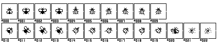
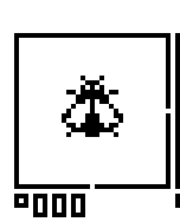
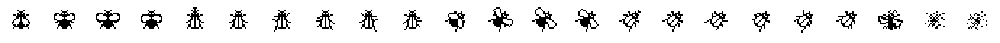

# µPS (npm package `gulp-mu-ps`)

*English (below) · [Deutsch](#deutsch)*

The technical package name is `gulp-mu-ps` (the µ character causes trouble in npm/git names); **µPS** is the display name.

Node module that replaces the image-processing functions of the old Adobe-based µCSS workflow — without an Adobe dependency. From layered image drafts (PSD; Affinity Photo can export PSD), PNG series are rendered with reproduced layer effects.

## Status

- **ButtonAndIconCreator**: Node port of the µCSS plugin of the same name, tested against the reference images of the old toolchain (`oldsrcs/old_adobe_scripts/µCSS/examples`).
- **AppIconMaker**: Node port of the µCSS plugin of the same name, updated to the platform requirements of 2026 (profile-based instead of the fixed 2014 favicon list).
- **SpriteAtlas**: sprite atlas generation (the basis for `µ.Sprite`/`µ.Cursor` in microCSS), bin packer ported from `SpriteTools.js`.
- **TileSheet**: foundation of tile computation (for Oxyd and the later Unity3D processing via Gulp) — uniform tiles, duplicate reduction, empty-tile detection, square textures in GPU-friendly sizes.
- **SequenceStrip**: horizontal sprite strips from image sequences (single files or DSD format), tested against the reference outputs of the old SpriteTools pipeline (`examples/specialimgs`).

Not yet ported (deliberately later milestones, template in `oldsrcs/SpriteTools.js`): the Oxyd-specific tile pipeline (DSD format scan, shadow cuts/masks, lighting masks, crack tiles, layer info bits) as well as `CreateTileSpriteTexture` with layer separation for Unity3D.

## ButtonAndIconCreator

Expected layer structure of the draft document (master at @2x resolution):

```
layouts/
  <layout>/            e.g. "std", "alu", "aqua"
    <state>/           e.g. "normal", "hover" — or "_" (see naming scheme)
      ...              background layers
      icon             placeholder layer carrying the layer effects for icons
icons/
  <glyphName>          one pixel layer or group per icon glyph, e.g. "but_login_"
```

For each combination of glyph and state, the layer effects of the `icon` placeholder are transferred onto the glyph (equivalent to "copy/paste layer style"), the document is rendered and saved. If a glyph consists of several layers (a group), the layer style is applied to the merged group result; within the group, the layers that are visible in the source document are shown. Glyphs named `_` are skipped (reserve/template layers).

```js
import { ButtonAndIconCreator } from "gulp-mu-ps";

const files = await ButtonAndIconCreator.Create("drafts/buttons.psd", {
	layout: "aqua",
	outputDir: "imgs/aqua"
});
// files => list of the generated image files
```

| Option | Default | Effect |
| :--- | :--- | :--- |
| `layout` | — (required) | Name of the layout group under `layouts/` whose states are rendered. The layout name does **not** appear in the file name — different layouts are distinguished via `outputDir` (e.g. `imgs/alu`, `imgs/aqua`). |
| `outputDir` | — (required) | Target directory; created if needed. |
| `retina` | `true` | The document is interpreted as an @2x master: `<name>@2x.<ext>` (full resolution) **and** `<name>.<ext>` (scaled down to 50 %, Lanczos) are produced. With `false`, only `<name>.<ext>` at document resolution is produced. |
| `format` | `"png"` | `"png"` or `"webp"` (lossless). Determines the file format and extension. |
| `iconsGroupName` | `"icons"` | Name of the group holding the icon glyphs. |
| `layoutsGroupName` | `"layouts"` | Name of the group holding the layouts. |

### Naming scheme of the generated images

```
<glyphName><stateName>[@2x].<png|webp>
```

- **The state name is appended directly** (no separator): glyph `but_login_` + state `normal` → `but_login_normal.png`. The underscore comes from the glyph name.
- **If the state group is named `_`, the suffix is dropped**: glyph `pointer` + state `_` → `pointer.png`. This is how e.g. `cursors.psd` works — there is only the state `_`, and the files are simply named `zoom.png`, `pointer.png`, etc.
- **The layout name (`std`, `alu`, `aqua`, …) never appears in the file name**; it only selects which layout group is rendered.
- With `retina: true`, the `@2x` variant is produced for every image.

### CreateByTopLayerSets — one image per group

Besides the icon×state matrix (`Create`), there is the second legacy mode `CreateByTopLayerSets`: here **no `icons` group** is needed. Every direct subgroup of the layout group is already a finished composition and becomes **one** image, named after the group. Typical use: logos, animation frames (e.g. `activityindicator`), emoticons — that is, image series where there are no interchangeable icon glyphs but finished individual motifs.

Expected layer structure:

```
<layout>/              name of the top group, e.g. "std"
  <setName>/           one group per output image, e.g. "frame01", "frame02"
    ...                finished layers
  _/                   groups named "_" are skipped (template)
```

```js
import { ButtonAndIconCreator } from "gulp-mu-ps";

const files = await ButtonAndIconCreator.CreateByTopLayerSets("drafts/activityindicator.psd", {
	layout: "std",
	outputDir: "imgs/general"
});
// produces e.g. imgs/general/frame01.png (+@2x), frame02.png (+@2x), …
```

| Option | Default | Effect |
| :--- | :--- | :--- |
| `layout` | — (required) | Name of the top group (legacy `srcLayout`) whose subgroups are exported. |
| `outputDir` | — (required) | Target directory; created if needed. |
| `retina` | `true` | As with `Create`: @2x master, produces `<setName>@2x.<ext>` **and** the `<setName>.<ext>` scaled down to 50 %. |
| `format` | `"png"` | `"png"` or `"webp"` (lossless). |
| `setPattern` | `null` | Optional `RegExp` (or regex string). Only subgroups with a matching name are exported. Without it, all groups except `_`. |

When rendering, only the current subgroup is made visible (sibling groups are hidden); the inner layer visibility of each group is preserved as in the source document — exactly like the old plugin.

## SpriteAtlas

Create a sprite atlas (1x + @2x + JSON mapping for the later CSS rewrite):

```js
import { SpriteAtlas } from "gulp-mu-ps";

const atlas = await SpriteAtlas.Create({
	images: ["imgs/aqua/but_login_normal.png", "imgs/aqua/but_login_hover.png"],
	outputFile: "imgs/sprites.png",
	retina: true
});
// atlas.sprites["imgs/aqua/but_login_normal.png"] => { x, y, width, height }
```

| Option | Default | Effect |
| :--- | :--- | :--- |
| `images` | — (required) | 1x source images; the order influences the packing. |
| `outputFile` | — (required) | Atlas file, e.g. `imgs/sprites.png`. A `.webp` extension produces a lossless WebP atlas. |
| `retina` | `true` | Additionally writes `<name>@2x.<ext>` from the `<source>@2x.<ext>` files, which must sit next to the sources. |
| `deduplicate` | `true` | Content-identical source images share one atlas position. |
| `padding` | `0` | Spacing in pixels between the sprites (1x). |
| `doSquare` | `true` | The atlas grows preferably square (instead of in one direction). |
| `writeMapFile` | `true` | Writes `<outputFile>.json` with the size and sprite positions. |

## TileSheet

Create a tile texture (sources are split into a grid of uniform tiles):

```js
import { TileSheet } from "gulp-mu-ps";

const sheet = await TileSheet.Create({
	images: ["tiles/O.FLR.00.0.png", "tiles/P.FLR.01.pattern.png"],
	outputFile: "textures/floor.png",
	tileSize: 64
});
// sheet.sources[file].tiles => tile indices per source image, -1 = empty tile
```

| Option | Default | Effect |
| :--- | :--- | :--- |
| `images` | — (required) | Source images (single tiles or tile grids); width/height must be multiples of `tileSize`. |
| `outputFile` | — (required) | Target texture. A `.webp` extension produces lossless WebP. |
| `tileSize` | `64` | Edge length of the tiles in pixels. |
| `deduplicate` | `true` | Identical tiles are added to the texture only once. |
| `duplicateTolerance` | `0` | Mean absolute channel difference up to which tiles count as equal (`0` = bit-exact; corresponds to the old "dubRedSen" sensitivity). |
| `dropEmptyTiles` | `true` | Fully transparent tiles do not end up in the texture but as index `-1` in the mapping. |
| `textureSizes` | `[128 … 4096]` | Allowed square texture sizes; the smallest fitting one is chosen. |
| `writeMapFile` | `true` | Writes `<outputFile>.json` with tile positions and source mappings. |

## SequenceStrip

From an image sequence (animation frames) it produces a **horizontal strip image**: all frames sit side by side in cells of equal size, plus a JSON file with the frame data (format of the old SpriteTools pipeline). The source can be either a series of single files or a single image in DSD format (see below).

```js
import { SequenceStrip } from "gulp-mu-ps";

// Variant 1: actual single files (@2x master, e.g. renderings from Cinema 4D)
const result = await SequenceStrip.Create({
	images: ["imgs/O_EFX_00_smoke.0000.png", "imgs/O_EFX_00_smoke.0001.png" /* ... */],
	outputFile: "out/smoke.png"
});

// Variant 2: one DSD-format image (1x pixel-art master)
const result2 = await SequenceStrip.Create({
	dsdImage: "imgs/flyex.png",
	outputFile: "out/flyex.png"
});
// result.map => { info: { maxWidth, maxHeight, offX, offY }, series: {...}, sprites: [...] }
```

| Option | Default | Effect |
| :--- | :--- | :--- |
| `images` | — | Frame files of the sequence (@2x master). If the names follow the scheme `<prefix>_<layer>_<nn>_<name>.<seq>.png` (e.g. `O_EFX_00_smoke.0000.png`), the series name, order and layer info bits are derived from them; otherwise the call order and the output file name count. |
| `dsdImage` | — | Alternative to `images`: a single DSD-format image (1x). The @2x variant is created by lossless pixel doubling (nearest neighbor). |
| `outputFile` | — (required) | Strip file, e.g. `out/smoke.png`. A `.webp` extension produces lossless WebP. |
| `retina` | `true` | Writes `<name>@2x.<ext>` plus the `<name>.<ext>` scaled down to 50 %. With `false`, only `<name>.<ext>` at source resolution is produced. |
| `writeMapFile` | `true` | Writes `<name>.json` with cell size, anchor and frame rectangles. |

For file sequences, each frame is trimmed to its content (trimmed against the background color of pixel 0/0); the union of all trim boxes determines the cell size. This keeps the strip compact even though the source frames are e.g. 192×192. In the JSON, each frame carries the content rectangle (`w`, `h`) and the anchor relative to the image center (`xo`, `yo`).

Example — from 19 single frames (192×192) this strip with 44×64 cells is produced:


### The DSD format

DSD ("Dongleware Sprite Definition") is a source format for pixel-art animations: all frames sit in **one** image, each frame inside a rectangular marker cell. Example (`flyex.png`, 23 frames):



Structure of a cell (excerpt, magnified 6×):



- **Frame**: 1 pixel wide, in any marker color — it only has to differ from the background color (pixel 0/0 of the image). Inside the frame follows 1 pixel of spacing, then the frame content.
- **Origin marker**: the right frame edge runs only down to the anchor Y position, the bottom edge only to the anchor X position (clearly visible in the zoom image: both edges end early). This way each frame carries its own registration point, e.g. for animations whose frames differ in size.
- **Label**: below the cell are 3×5-pixel glyphs in the marker color: first a type glyph (original, mask, shadow, light, original+mask), then the three-digit frame number (`□000` in the zoom image = original, frame 0).

#### Glyph reference (binding for authoring)

The scanner recognizes only exactly these 3×5-pixel glyphs (set pixels in the marker color). When authoring your own DSD images, exactly these pixel patterns must be used:


The same patterns as a pixel grid (`█` = marker color, `·` = empty):

```
 0    1    2    3    4    5    6    7    8    9
███  ·█·  ███  ███  █·█  ███  ███  ███  ███  ███
█·█  ·█·  ··█  ··█  █·█  █··  █··  ··█  █·█  █·█
█·█  ·█·  ███  ███  ███  ███  ███  ··█  ███  ███
█·█  ·█·  █··  ··█  ··█  ··█  █·█  ··█  █·█  ··█
███  ·█·  ███  ███  ··█  ███  ███  ··█  ███  ███

Original   Mask       Shadow     Light      Org+Mask
███        ███        ···        █·█        ·██
█·█        ███        ···        ·█·        █··
███        ███        ···        █·█        ·█·
···        ···        ···        ···        ··█
···        ···        ███        ███        ██·
```

Placement rules for the label:

- The label starts **one empty line below the bottom cell frame**, left-aligned to the left frame column.
- Each glyph is 3 px wide and 5 px high; the horizontal advance is **4 px** (3 px glyph + 1 px gap).
- Order: type glyph, then **exactly three** digits (frame number with leading zeros, e.g. `□007`).
- All label pixels must have exactly the marker color of the associated cell frame.

The canonical patterns are exported in the code as `DSD_SIGN_PATTERNS`.

<!-- publish:exclude:start -->
The reference image above is generated from these patterns with `node tools/render-dsd-glyphs.mjs` (re-run after pattern changes).
<!-- publish:exclude:end -->

The scanner (`ScanDsdImage`) detects the cells automatically; `SequenceStrip` assembles the strip from them in the order of the frame numbers:



## AppIconMaker

Generate app icons from a square master (PSD or PNG, recommended ≥ 1024×1024):

```js
import { AppIconMaker } from "gulp-mu-ps";

const files = await AppIconMaker.Create("drafts/appicon.psd", {
	outputDir: "icons",
	profiles: ["web", "ios", "play"],
	layout: "aqua",
	appName: "AiDPix",
	themeColor: "#0a5ae0",
	background: "#ffffff"
});
```

| Option | Default | Effect |
| :--- | :--- | :--- |
| `outputDir` | — (required) | Target directory. |
| `profiles` | `["web", "ios", "play"]` | Profile names and/or custom profile objects (see below). |
| `layout` | `null` | Only for PSD sources: shows exactly this top-level group (like the old `_switchLayout`). |
| `background` | `"#ffffff"` | Background color for the `flatten`, `maskable` and `background` modes. |
| `appName` | `"App"` | Name in the `site.webmanifest`. |
| `shortName` | = `appName` | Short name in the manifest. |
| `themeColor` | `"#ffffff"` | `theme_color` in the manifest and HTML snippet. |

| Profile | Produces |
| :--- | :--- |
| `web` | `favicon.ico` (16/32/48), `favicon-16/32/48/96`, `apple-touch-icon` (180), PWA `icon-192`/`icon-512`, `icon-512-maskable` (logo in the 80 % safe zone on an opaque background) plus `site.webmanifest` and the HTML snippet `appicons.html` |
| `ios` | `appstore-icon-1024.png` — the only asset still needed (Xcode "Single Size"), the alpha channel is removed |
| `play` | `playstore-icon-512.png` (listing) plus the adaptive-icon layers `adaptive-foreground-432.png` (logo in the 66/108-dp safe zone, transparent border) and `adaptive-background-432.png` |

Custom profiles are possible as `{ name, icons: [{ file, size, mode }] }` (`mode`: `plain`, `flatten`, `maskable`, `background`, `ico`).

## More building blocks of the API

| Export | Description |
| :--- | :--- |
| `PsDocument` | Load a PSD (via `ag-psd`), traverse the layer tree, control visibilities |
| `RenderDocument` | Composite all visible layers into an RGBA raster |
| `SaveRasterAsImage` / `SaveRasterAsImageHalfSize` | Image export (via `sharp`), format by file extension (`.png`/`.webp`), @2x→1x downscale |
| `ButtonAndIconCreator` | Generate button/icon series from a draft document |
| `AppIconMaker` | Generate app icons/favicons profile-based (web, ios, play, custom) |
| `SpriteAtlas` | Sprite atlas with deduplication, padding option and JSON mapping |
| `TileSheet` | Tile texture: splitting, duplicate reduction (exact or with tolerance), empty tiles |
| `SequenceStrip` | Horizontal sprite strips from image sequences or DSD-format images |
| `ScanDsdImage` | DSD-format scanner: detects cells, types, frame numbers and anchors |
| `PackRects` / `PackRectsStrictSquare` | Bin packer (growing or strictly square with a maximum size) |

## Reproduced layer effects

The effects are approximations of the PS/Affinity behavior (visual closeness, not bit-exactness):

- Color overlay (`solidFill`)
- Gradient overlay (`gradientOverlay`, linear)
- Inner/outer glow (`innerGlow`, `outerGlow`)
- Inner shadow (`innerShadow`), drop shadow (`dropShadow`)
- Bevel and emboss (`bevel`, simplified)

Supported blend modes: normal, multiply, screen, overlay, darken, lighten, color burn/dodge, linear burn/dodge, hard/soft light, difference, exclusion as well as "pass through" for groups.

<!-- publish:exclude:start -->
## Tests

```
npm test          # in the microPS directory
npx gulp test     # in the project root
```

The tests render `examples/drafts/buttons.psd` and `examples/drafts/cursors.psd` and compare the outputs against the reference PNGs of the old Adobe toolchain. The quality metric is the mean absolute error (MAE, 0–255, alpha-weighted) with tolerances per layout and resolution (buttons — alu: 12, aqua: 13; cursors — @2x: 5, 1x: 20; the 1x variants deviate more because the old toolchain downscaled with "bicubic sharper").

## Tools

- `node tools/inspect-psd.mjs <file.psd>` — print the layer tree and layer effects of a PSD
- `node tools/compare-images.mjs <a> <b>` — compare PNG files or directories (MAE)
- `node tools/render-dsd-glyphs.mjs` — generate the DSD glyph reference image from `DSD_SIGN_PATTERNS`
<!-- publish:exclude:end -->

---

<a name="deutsch"></a>

# µPS (npm-Paket `gulp-mu-ps`)

*[English](#µps-npm-package-gulp-mu-ps) · Deutsch (unten)*

Der technische Paketname ist `gulp-mu-ps` (das µ-Zeichen bereitet in npm-/git-Namen Probleme); **µPS** ist der Anzeigename.

Node-Modul, das die bildverarbeitenden Funktionen des alten Adobe-basierten µCSS-Workflows ersetzt — ohne Adobe-Abhängigkeit. Aus geschichteten Bildentwürfen (PSD; Affinity Photo kann PSD exportieren) werden PNG-Serien mit nachgebildeten Fülloptionen gerendert.

## Status

- **ButtonAndIconCreator**: Node-Port des gleichnamigen µCSS-Plugins, getestet gegen die Referenzbilder der alten Toolchain (`oldsrcs/old_adobe_scripts/µCSS/examples`).
- **AppIconMaker**: Node-Port des gleichnamigen µCSS-Plugins, aktualisiert auf die Plattform-Anforderungen von 2026 (profilbasiert statt fixer 2014er-Favicon-Liste).
- **SpriteAtlas**: Sprite-Atlas-Generierung (Grundlage für `µ.Sprite`/`µ.Cursor` in microCSS), Bin-Packer aus `SpriteTools.js` portiert.
- **TileSheet**: Fundament der Tileberechnung (für Oxyd und die spätere Unity3D-Aufbereitung via Gulp) — uniforme Tiles, Duplikat-Reduktion, Leer-Tile-Erkennung, quadratische Texturen in GPU-freundlichen Größen.
- **SequenceStrip**: Horizontale Sprite-Strips aus Bildsequenzen (Einzeldateien oder DSD-Format), getestet gegen die Referenzausgaben der alten SpriteTools-Pipeline (`examples/specialimgs`).

Noch nicht portiert (bewusst spätere Meilensteine, Vorlage in `oldsrcs/SpriteTools.js`): die Oxyd-spezifische Tile-Pipeline (DSD-Format-Scan, Schatten-Cuts/-Masken, Lighting-Masken, Crack-Tiles, Layer-Infobits) sowie `CreateTileSpriteTexture` mit Layer-Separation für Unity3D.

## ButtonAndIconCreator

Erwartete Ebenenstruktur des Entwurfsdokuments (Master in @2x-Auflösung):

```
layouts/
  <layout>/            z. B. "std", "alu", "aqua"
    <state>/           z. B. "normal", "hover" — oder "_" (siehe Namensschema)
      ...              Hintergrund-Ebenen
      icon             Platzhalter-Ebene, trägt die Fülloptionen für Icons
icons/
  <glyphName>          eine Pixel-Ebene oder Gruppe pro Icon-Glyphe, z. B. "but_login_"
```

Für jede Kombination aus Glyphe und State werden die Fülloptionen des `icon`-Platzhalters auf die Glyphe übertragen (entspricht „Ebenenstil kopieren/einfügen"), das Dokument gerendert und gespeichert. Besteht eine Glyphe aus mehreren Ebenen (Gruppe), wird der Ebenenstil auf das zusammengeführte Gruppenergebnis angewendet; innerhalb der Gruppe werden die Ebenen eingeblendet, die im Quelldokument sichtbar sind. Glyphen mit dem Namen `_` werden übersprungen (Reserve-/Vorlagenebenen).

```js
import { ButtonAndIconCreator } from "gulp-mu-ps";

const files = await ButtonAndIconCreator.Create("drafts/buttons.psd", {
	layout: "aqua",
	outputDir: "imgs/aqua"
});
// files => Liste der erzeugten Bilddateien
```

| Option | Default | Wirkung |
| :--- | :--- | :--- |
| `layout` | — (Pflicht) | Name der Layout-Gruppe unter `layouts/`, deren States gerendert werden. Der Layout-Name erscheint **nicht** im Dateinamen — verschiedene Layouts unterscheidet man über `outputDir` (z. B. `imgs/alu`, `imgs/aqua`). |
| `outputDir` | — (Pflicht) | Zielverzeichnis; wird bei Bedarf angelegt. |
| `retina` | `true` | Das Dokument wird als @2x-Master interpretiert: Es entstehen `<name>@2x.<ext>` (volle Auflösung) **und** `<name>.<ext>` (auf 50 % verkleinert, Lanczos). Bei `false` entsteht nur `<name>.<ext>` in Dokumentauflösung. |
| `format` | `"png"` | `"png"` oder `"webp"` (verlustfrei). Bestimmt Dateiformat und -endung. |
| `iconsGroupName` | `"icons"` | Name der Gruppe mit den Icon-Glyphen. |
| `layoutsGroupName` | `"layouts"` | Name der Gruppe mit den Layouts. |

### Namensschema der erzeugten Bilder

```
<glyphName><stateName>[@2x].<png|webp>
```

- **Der State-Name wird direkt angehängt** (kein Trenner): Glyphe `but_login_` + State `normal` → `but_login_normal.png`. Der Unterstrich stammt aus dem Glyphennamen.
- **Heißt die State-Gruppe `_`, entfällt der Suffix**: Glyphe `pointer` + State `_` → `pointer.png`. So arbeitet z. B. `cursors.psd` — dort gibt es nur den State `_`, die Dateien heißen schlicht `zoom.png`, `pointer.png` usw.
- **Der Layout-Name (`std`, `alu`, `aqua`, …) taucht nie im Dateinamen auf**; er wählt nur aus, welche Layout-Gruppe gerendert wird.
- Bei `retina: true` entsteht zu jedem Bild zusätzlich die `@2x`-Variante.

### CreateByTopLayerSets — ein Bild pro Gruppe

Neben der Icon×State-Matrix (`Create`) gibt es den zweiten Legacy-Modus `CreateByTopLayerSets`: Hier ist **keine `icons`-Gruppe** nötig. Jede direkte Untergruppe der Layout-Gruppe ist bereits eine fertige Komposition und wird zu **einem** Bild, benannt nach dem Gruppennamen. Typische Anwendung: Logos, Animationsframes (z. B. `activityindicator`), Emoticons — also Bildserien, bei denen es keine austauschbaren Icon-Glyphen, sondern fertig gestaltete Einzelmotive gibt.

Erwartete Ebenenstruktur:

```
<layout>/              Name der Top-Gruppe, z. B. "std"
  <setName>/           eine Gruppe pro Ausgabebild, z. B. "frame01", "frame02"
    ...                fertig gestaltete Ebenen
  _/                   Gruppen mit Namen "_" werden übersprungen (Vorlage)
```

```js
import { ButtonAndIconCreator } from "gulp-mu-ps";

const files = await ButtonAndIconCreator.CreateByTopLayerSets("drafts/activityindicator.psd", {
	layout: "std",
	outputDir: "imgs/general"
});
// erzeugt z. B. imgs/general/frame01.png (+@2x), frame02.png (+@2x), …
```

| Option | Default | Wirkung |
| :--- | :--- | :--- |
| `layout` | — (Pflicht) | Name der Top-Gruppe (Legacy-`srcLayout`), deren Untergruppen exportiert werden. |
| `outputDir` | — (Pflicht) | Zielverzeichnis; wird bei Bedarf angelegt. |
| `retina` | `true` | Wie bei `Create`: @2x-Master, erzeugt `<setName>@2x.<ext>` **und** das auf 50 % verkleinerte `<setName>.<ext>`. |
| `format` | `"png"` | `"png"` oder `"webp"` (verlustfrei). |
| `setPattern` | `null` | Optionales `RegExp` (oder Regex-String). Nur Untergruppen mit passendem Namen werden exportiert. Ohne Angabe alle Gruppen außer `_`. |

Beim Rendern wird jeweils nur die aktuelle Untergruppe sichtbar geschaltet (Geschwistergruppen werden ausgeblendet); die innere Ebenen-Sichtbarkeit jeder Gruppe bleibt wie im Quelldokument erhalten — exakt wie im alten Plugin.

## SpriteAtlas

Sprite-Atlas erstellen (1x + @2x + JSON-Mapping für die spätere CSS-Umschreibung):

```js
import { SpriteAtlas } from "gulp-mu-ps";

const atlas = await SpriteAtlas.Create({
	images: ["imgs/aqua/but_login_normal.png", "imgs/aqua/but_login_hover.png"],
	outputFile: "imgs/sprites.png",
	retina: true
});
// atlas.sprites["imgs/aqua/but_login_normal.png"] => { x, y, width, height }
```

| Option | Default | Wirkung |
| :--- | :--- | :--- |
| `images` | — (Pflicht) | 1x-Quellbilder; die Reihenfolge beeinflusst die Packung. |
| `outputFile` | — (Pflicht) | Atlas-Datei, z. B. `imgs/sprites.png`. Endung `.webp` erzeugt einen verlustfreien WebP-Atlas. |
| `retina` | `true` | Schreibt zusätzlich `<name>@2x.<ext>` aus den `<quelle>@2x.<ext>`-Dateien, die neben den Quellen liegen müssen. |
| `deduplicate` | `true` | Inhaltsgleiche Quellbilder teilen sich eine Atlas-Position. |
| `padding` | `0` | Abstand in Pixeln zwischen den Sprites (1x). |
| `doSquare` | `true` | Atlas wächst bevorzugt quadratisch (statt in eine Richtung). |
| `writeMapFile` | `true` | Schreibt `<outputFile>.json` mit Größe und Sprite-Positionen. |

## TileSheet

Tile-Textur erstellen (Quellen werden in ein Raster aus uniformen Tiles zerlegt):

```js
import { TileSheet } from "gulp-mu-ps";

const sheet = await TileSheet.Create({
	images: ["tiles/O.FLR.00.0.png", "tiles/P.FLR.01.pattern.png"],
	outputFile: "textures/floor.png",
	tileSize: 64
});
// sheet.sources[file].tiles => Tile-Indizes je Quellbild, -1 = leeres Tile
```

| Option | Default | Wirkung |
| :--- | :--- | :--- |
| `images` | — (Pflicht) | Quellbilder (einzelne Tiles oder Tile-Raster); Breite/Höhe müssen Vielfache von `tileSize` sein. |
| `outputFile` | — (Pflicht) | Ziel-Textur. Endung `.webp` erzeugt verlustfreies WebP. |
| `tileSize` | `64` | Kantenlänge der Tiles in Pixeln. |
| `deduplicate` | `true` | Identische Tiles werden nur einmal in die Textur aufgenommen. |
| `duplicateTolerance` | `0` | Mittlere absolute Kanaldifferenz, bis zu der Tiles als gleich gelten (`0` = bitgenau; entspricht der alten „dubRedSen"-Empfindlichkeit). |
| `dropEmptyTiles` | `true` | Voll transparente Tiles landen nicht in der Textur, sondern als Index `-1` im Mapping. |
| `textureSizes` | `[128 … 4096]` | Erlaubte quadratische Texturgrößen; die kleinste passende wird gewählt. |
| `writeMapFile` | `true` | Schreibt `<outputFile>.json` mit Tile-Positionen und Quell-Mappings. |

## SequenceStrip

Erzeugt aus einer Bildsequenz (Animations-Frames) ein **horizontales Strip-Bild**: Alle Frames liegen in gleich großen Zellen nebeneinander, dazu wird eine JSON-Datei mit den Frame-Daten geschrieben (Format der alten SpriteTools-Pipeline). Die Quelle kann entweder eine Serie einzelner Dateien sein oder ein einzelnes Bild im DSD-Format (siehe unten).

```js
import { SequenceStrip } from "gulp-mu-ps";

// Variante 1: echte Einzeldateien (@2x-Master, z. B. Renderings aus Cinema 4D)
const result = await SequenceStrip.Create({
	images: ["imgs/O_EFX_00_smoke.0000.png", "imgs/O_EFX_00_smoke.0001.png" /* ... */],
	outputFile: "out/smoke.png"
});

// Variante 2: ein DSD-Format-Bild (1x-Pixel-Art-Master)
const result2 = await SequenceStrip.Create({
	dsdImage: "imgs/flyex.png",
	outputFile: "out/flyex.png"
});
// result.map => { info: { maxWidth, maxHeight, offX, offY }, series: {...}, sprites: [...] }
```

| Option | Default | Wirkung |
| :--- | :--- | :--- |
| `images` | — | Frame-Dateien der Sequenz (@2x-Master). Folgen die Namen dem Schema `<prefix>_<layer>_<nn>_<name>.<seq>.png` (z. B. `O_EFX_00_smoke.0000.png`), werden Serienname, Reihenfolge und Layer-Infobits daraus abgeleitet; sonst zählt die Übergabereihenfolge und der Name der Ausgabedatei. |
| `dsdImage` | — | Alternativ zu `images`: ein einzelnes DSD-Format-Bild (1x). Die @2x-Variante entsteht durch verlustfreie Pixelverdopplung (Nearest Neighbor). |
| `outputFile` | — (Pflicht) | Strip-Datei, z. B. `out/smoke.png`. Endung `.webp` erzeugt verlustfreies WebP. |
| `retina` | `true` | Schreibt `<name>@2x.<ext>` plus die auf 50 % verkleinerte `<name>.<ext>`. Bei `false` entsteht nur `<name>.<ext>` in Quellauflösung. |
| `writeMapFile` | `true` | Schreibt `<name>.json` mit Zellgröße, Anker und Frame-Rechtecken. |

Bei Dateisequenzen wird jeder Frame auf seinen Inhalt beschnitten (Trim gegen die Hintergrundfarbe von Pixel 0/0); die Vereinigung aller Trim-Boxen bestimmt die Zellgröße. So bleibt der Strip kompakt, obwohl die Quell-Frames z. B. 192×192 groß sind. Im JSON stehen pro Frame das Inhalts-Rechteck (`w`, `h`) und der Anker relativ zur Bildmitte (`xo`, `yo`).

Beispiel — aus 19 Einzel-Frames (192×192) wird dieser Strip mit 44×64er-Zellen:


### Das DSD-Format

DSD („Dongleware Sprite Definition") ist ein Quellformat für Pixel-Art-Animationen: Alle Frames liegen in **einem** Bild, jeder Frame steckt in einer rechteckigen Markierungszelle. Beispiel (`flyex.png`, 23 Frames):


Aufbau einer Zelle (Ausschnitt, 6-fach vergrößert):


- **Rahmen**: 1 Pixel breit, in einer beliebigen Markerfarbe — sie muss sich nur von der Hintergrundfarbe (Pixel 0/0 des Bildes) unterscheiden. Innerhalb des Rahmens folgt 1 Pixel Abstand, dann der Frame-Inhalt.
- **Origin-Marker**: Der rechte Rahmenrand ist nur bis zur Anker-Y-Position durchgezogen, der untere Rand nur bis zur Anker-X-Position (im Zoom-Bild gut sichtbar: beide Ränder enden vorzeitig). Damit trägt jeder Frame seinen eigenen Registrierpunkt, z. B. für Animationen, deren Frames unterschiedlich groß sind.
- **Label**: Unter der Zelle stehen 3×5-Pixel-Glyphen in der Markerfarbe: zuerst eine Typ-Glyphe (Original, Maske, Schatten, Licht, Original+Maske), dann die dreistellige Frame-Nummer (`□000` im Zoom-Bild = Original, Frame 0).

#### Glyphen-Referenz (für die Erstellung verbindlich)

Der Scanner erkennt nur exakt diese 3×5-Pixel-Glyphen (gesetzte Pixel in der Markerfarbe). Beim Erstellen eigener DSD-Bilder müssen genau diese Pixelmuster verwendet werden:


Dieselben Muster als Pixelraster (`█` = Markerfarbe, `·` = frei):

```
 0    1    2    3    4    5    6    7    8    9
███  ·█·  ███  ███  █·█  ███  ███  ███  ███  ███
█·█  ·█·  ··█  ··█  █·█  █··  █··  ··█  █·█  █·█
█·█  ·█·  ███  ███  ███  ███  ███  ··█  ███  ███
█·█  ·█·  █··  ··█  ··█  ··█  █·█  ··█  █·█  ··█
███  ·█·  ███  ███  ··█  ███  ███  ··█  ███  ███

Original   Maske      Schatten   Licht      Org+Maske
███        ███        ···        █·█        ·██
█·█        ███        ···        ·█·        █··
███        ███        ···        █·█        ·█·
···        ···        ···        ···        ··█
···        ···        ███        ███        ██·
```

Platzierungsregeln für das Label:

- Das Label beginnt **eine Leerzeile unter dem unteren Zellrahmen**, linksbündig zur linken Rahmenspalte.
- Jede Glyphe ist 3 px breit und 5 px hoch; der horizontale Vorschub beträgt **4 px** (3 px Glyphe + 1 px Lücke).
- Reihenfolge: Typ-Glyphe, dann **genau drei** Ziffern (Frame-Nummer mit führenden Nullen, z. B. `□007`).
- Alle Label-Pixel müssen exakt die Markerfarbe des zugehörigen Zellrahmens haben.

Die kanonischen Muster sind im Code als `DSD_SIGN_PATTERNS` exportiert.

<!-- publish:exclude:start -->
Das Referenzbild oben wird mit `node tools/render-dsd-glyphs.mjs` aus diesen Mustern generiert (nach Pattern-Änderungen neu ausführen).
<!-- publish:exclude:end -->

Der Scanner (`ScanDsdImage`) erkennt die Zellen automatisch; `SequenceStrip` setzt daraus den Strip in der Reihenfolge der Frame-Nummern zusammen:


## AppIconMaker

App-Icons aus einem quadratischen Master (PSD oder PNG, empfohlen ≥ 1024×1024) generieren:

```js
import { AppIconMaker } from "gulp-mu-ps";

const files = await AppIconMaker.Create("drafts/appicon.psd", {
	outputDir: "icons",
	profiles: ["web", "ios", "play"],
	layout: "aqua",
	appName: "AiDPix",
	themeColor: "#0a5ae0",
	background: "#ffffff"
});
```

| Option | Default | Wirkung |
| :--- | :--- | :--- |
| `outputDir` | — (Pflicht) | Zielverzeichnis. |
| `profiles` | `["web", "ios", "play"]` | Profilnamen und/oder eigene Profilobjekte (siehe unten). |
| `layout` | `null` | Nur bei PSD-Quellen: Blendet genau diese Top-Level-Gruppe ein (wie das alte `_switchLayout`). |
| `background` | `"#ffffff"` | Hintergrundfarbe für `flatten`-, `maskable`- und `background`-Modi. |
| `appName` | `"App"` | Name im `site.webmanifest`. |
| `shortName` | = `appName` | Kurzname im Manifest. |
| `themeColor` | `"#ffffff"` | `theme_color` in Manifest und HTML-Snippet. |

| Profil | Erzeugt |
| :--- | :--- |
| `web` | `favicon.ico` (16/32/48), `favicon-16/32/48/96`, `apple-touch-icon` (180), PWA `icon-192`/`icon-512`, `icon-512-maskable` (Logo in 80-%-Safe-Zone auf opakem Hintergrund) sowie `site.webmanifest` und HTML-Snippet `appicons.html` |
| `ios` | `appstore-icon-1024.png` — einziges noch benötigtes Asset (Xcode „Single Size"), Alpha-Kanal wird entfernt |
| `play` | `playstore-icon-512.png` (Listing) plus Adaptive-Icon-Ebenen `adaptive-foreground-432.png` (Logo in 66/108-dp-Safe-Zone, transparenter Rand) und `adaptive-background-432.png` |

Eigene Profile sind als `{ name, icons: [{ file, size, mode }] }` möglich (`mode`: `plain`, `flatten`, `maskable`, `background`, `ico`).

## Weitere Bausteine der API

| Export | Beschreibung |
| :--- | :--- |
| `PsDocument` | PSD laden (via `ag-psd`), Ebenenbaum durchsuchen, Sichtbarkeiten steuern |
| `RenderDocument` | Compositing aller sichtbaren Ebenen zu einem RGBA-Raster |
| `SaveRasterAsImage` / `SaveRasterAsImageHalfSize` | Bild-Export (via `sharp`), Format per Dateiendung (`.png`/`.webp`), @2x→1x-Downscale |
| `ButtonAndIconCreator` | Button-/Icon-Serien aus einem Entwurfsdokument generieren |
| `AppIconMaker` | App-Icons/Favicons profilbasiert generieren (web, ios, play, custom) |
| `SpriteAtlas` | Sprite-Atlas mit Duplikat-Reduktion, Padding-Option und JSON-Mapping |
| `TileSheet` | Tile-Textur: Zerlegung, Duplikat-Reduktion (exakt oder mit Toleranz), Leer-Tiles |
| `SequenceStrip` | Horizontale Sprite-Strips aus Bildsequenzen oder DSD-Format-Bildern |
| `ScanDsdImage` | DSD-Format-Scanner: erkennt Zellen, Typen, Frame-Nummern und Anker |
| `PackRects` / `PackRectsStrictSquare` | Bin-Packer (wachsend bzw. strikt quadratisch mit Maximalgröße) |

## Nachgebildete Fülloptionen

Die Effekte sind Annäherungen an das PS-/Affinity-Verhalten (visuelle Nähe, keine Bit-Genauigkeit):

- Farbüberlagerung (`solidFill`)
- Verlaufsüberlagerung (`gradientOverlay`, linear)
- Schein nach innen / außen (`innerGlow`, `outerGlow`)
- Schatten nach innen (`innerShadow`), Schlagschatten (`dropShadow`)
- Abgeflachte Kante und Relief (`bevel`, vereinfacht)

Unterstützte Blend-Modi: normal, multiply, screen, overlay, darken, lighten, color burn/dodge, linear burn/dodge, hard/soft light, difference, exclusion sowie „pass through" für Gruppen.

<!-- publish:exclude:start -->
## Tests

```
npm test          # im Verzeichnis microPS
npx gulp test     # im Projektstamm
```

Die Tests rendern `examples/drafts/buttons.psd` und `examples/drafts/cursors.psd` und vergleichen die Ausgaben mit den Referenz-PNGs der alten Adobe-Toolchain. Als Qualitätsmaß dient der mittlere absolute Fehler (MAE, 0–255, alphagewichtet) mit Toleranzen pro Layout bzw. Auflösung (Buttons — alu: 12, aqua: 13; Cursors — @2x: 5, 1x: 20; die 1x-Varianten weichen stärker ab, weil die alte Toolchain mit „Bikubisch schärfer" herunterskalierte).

## Werkzeuge

- `node tools/inspect-psd.mjs <datei.psd>` — Ebenenbaum und Fülloptionen einer PSD ausgeben
- `node tools/compare-images.mjs <a> <b>` — PNG-Dateien oder -Verzeichnisse vergleichen (MAE)
- `node tools/render-dsd-glyphs.mjs` — DSD-Glyphen-Referenzbild aus `DSD_SIGN_PATTERNS` generieren
<!-- publish:exclude:end -->
